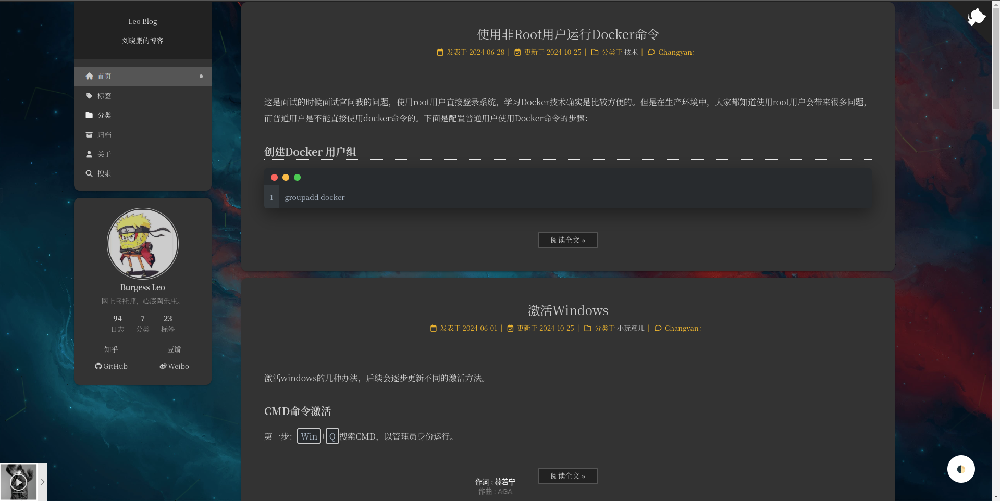

### The Site 
[http://nustarain.pages.dev](https://nustarain.pages.dev)



### Introduce

This is my first personal blog based on Hexo. I used Next as the theme because its community is very large and you can find answers to any questions you have here.

Now you have many better choices. Such as Hugo, it's faster than Hexo. 

Today I prefer to use simple theme ranther than colorful. I tried MdBook, it's like Handbook.

### Installation

If you want to try this repo. Ensure you have Node.js and Hexo installed. Hexo has strict version requirements on Node.js. You can refer this [The version requirements.](https://hexo.io/zh-cn/docs/#Node-js-%E7%89%88%E6%9C%AC%E9%99%90%E5%88%B6)

1. Clone this repo

```bash
git clone https://github.com/nustarain/nustarain.git
```

2. Install dependencies

```bash
npm install --froce
```

3. Start server

```bash
hexo server
```

### Reference

Maybe you can find some useful information in the following links.

[Hexo Official Website](https://hexo.io/zh-cn/)
[Hexo-Theme-Next](https://github.com/next-theme/hexo-theme-next)