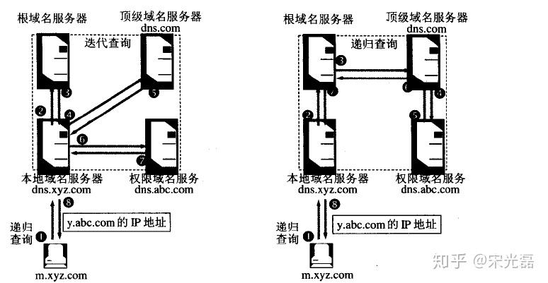

### DNS 的迭代查询和递归查询

首先来个总结：   
迭代查询；我不会你不会，你知道谁会，于是你让我去问。   
递归查询：我不会你不会，你帮我去问，问完回来告诉我。

<!-- more -->

知乎一篇文章写的很好，[**点击跳转**](https://zhuanlan.zhihu.com/p/61394192)

### 查询步骤

1. 客户机首先查看本地hosts文件是否有解析记录，有则直接用来访问web server
2. 没有则向网卡中记录的首选DNS(本地DNS) 发起查询请求
3. 本地DNS若有记录则返回给客户端，客户端接收到后直接访问web server
4. 若没有，则本地DNS向根域服务器发起请求，请求解析对应顶级域的IP地址
5. 本地DNS得到顶级域服务器IP后，再向顶级域服务器发起请求，请求解析权威DNS服务器的IP地址
6. 本地DNS服务器获取到权威DNS服务器IP地址后，再向其查询具体的完整域名的对
应解析记录
7. 最终本地DNS将杏询到的对应域名的解析记录发送给客户端，并在本地记录一份

### 智能 DNS 

智能DNS（Intelligent DNS）具有多种功能和优势，它可以为网络管理员、网站运营商和最终用户提供多种服务和增强功能。以下是智能DNS可以实现的一些功能：

1. **负载均衡**：
- 智能DNS可以分发流量到多个服务器或数据中心，以确保网络负载均衡。这有助于提高网站性能和可用性，避免服务器过载。

2. **地理定位**：
- 智能DNS可以根据用户的地理位置，将他们定向到最近或最优的服务器。这降低了响应时间，提高了用户体验。

3. **故障转移**：
- 如果某个服务器或数据中心出现故障，智能DNS可以自动将流量转移到备用服务器，确保连续性和可用性。

4. **内容分发**：
- 智能DNS可用于构建内容分发网络（CDN），通过将用户定向到最近的CDN节点，加速内容传送，降低延迟，并减少带宽消耗。

5. **安全性**：
- 智能DNS可以检测和阻止恶意流量，例如分布式拒绝服务攻击（DDoS），并提供防御措施，以确保网络的安全性。

6. **弹性伸缩**：
- 智能DNS可以根据实际流量负载自动扩展或缩小资源，以适应峰值和低谷时期的需求。

7. **DNS级别的安全性**：
- 智能DNS可以支持DNSSEC（DNS安全扩展），以保护DNS查询免受潜在的欺骗和中间人攻击。

8. **定制策略**：
- 智能DNS允许管理员根据自定义策略和需求来定制DNS解析行为，例如按照特定规则路由流量或控制缓存行为。

9. **监控和分析**：
- 智能DNS通常提供监控和分析功能，允许管理员跟踪流量、性能指标和DNS查询，以进行性能优化和故障排除。

10. **用户体验改进**：
- 通过提供更快的响应时间、减少延迟和确保高可用性，智能DNS可以改善用户的在线体验。

总之，智能DNS通过利用高级策略和技术，可以优化网络性能、提高可用性、增强安全性，并满足各种网络需求。这些功能使其成为企业、网站运营商和云服务提供商的关键工具，用于管理复杂的网络基础设施。