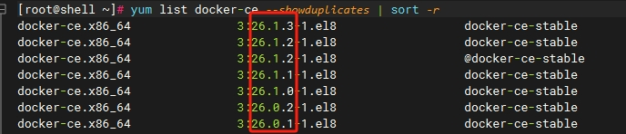

### 安装最新版本 Docker

官方提供了一键安装脚本，直接执行，耐心等待脚本执行完毕即可。

```bash
curl -fsSL https://get.docker.com | bash -s docker
```

<!-- more -->

### 安装指定版本 Docker

#### 卸载已经存在的 Docker 版本

如果已安装这些程序，请卸载它们以及相关的依赖项。

```bash
yum remove docker \
    docker-client \
    docker-client-latest \
    docker-common \
    docker-latest \
    docker-latest-logrotate \
    docker-logrotate \
    docker-engine
```

#### 配置安装仓库

安装所需的软件包。yum-utils 提供了 yum-config-manager，使用 yum-config-manager 可以轻松管理 Docker 的 yum 仓库。

```bash
yum install -y yum-utils
```

添加 Docker 的 yum 仓库，官方版，速度有点慢。

```bash
yum-config-manager \
    --add-repo \
    https://download.docker.com/linux/centos/docker-ce.repo
```

阿里版 Docker 的 yum 仓库。

```bash
yum-config-manager \
    --add-repo \
    https://mirrors.aliyun.com/docker-ce/linux/centos/docker-ce.repo
```

清华源版 Docker 的 yum 仓库。

```bash
yum-config-manager \
    --add-repo \
    https://mirrors.tuna.tsinghua.edu.cn/docker-ce/linux/centos/docker-ce.repo
```

#### 选择Docker 版本并安装

列出 Docker 版本。

```bash
yum list docker-ce --showduplicates | sort -r
```



通过其完整的软件包名称安装特定版本，例如：docker-ce-26.1.2。

```bash
yum install docker-ce-<VERSION_STRING> docker-ce-cli-<VERSION_STRING> containerd.io docker-compose-plugin
```

### 镜像加速

```bash
sudo mkdir -p /etc/docker
sudo tee /etc/docker/daemon.conf <<-'EOF'
{
  "registry-mirrors": ["https://az7a5oso.mirror.aliyuncs.com"]
}
EOF
sudo systemctl daemon-reload
sudo systemctl restart docker
```

### 卸载Docker

```bash
yum remove docker-ce
```

删除镜像、容器、配置文件等内容：

```bash
rm -rf /var/lib/docker
```