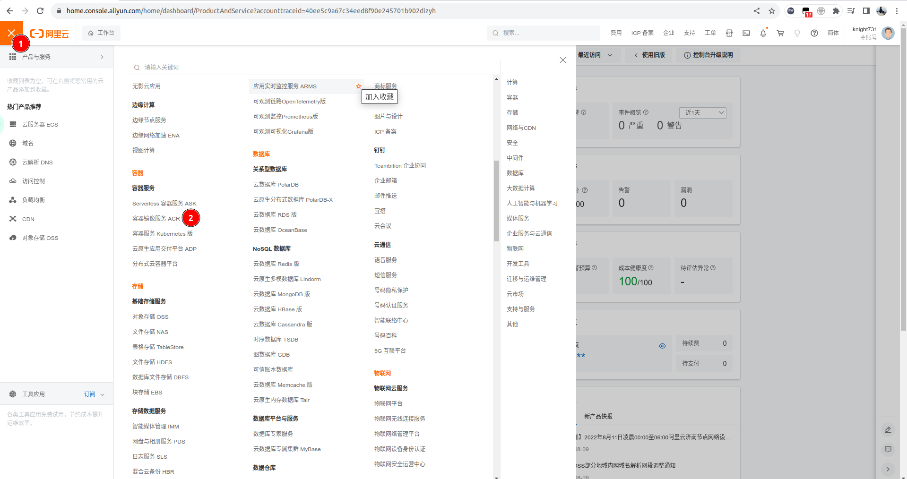
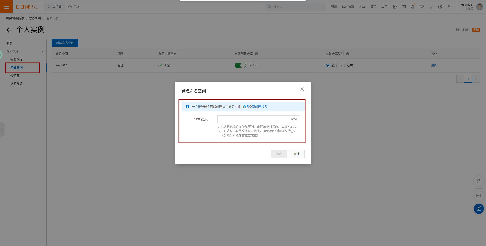
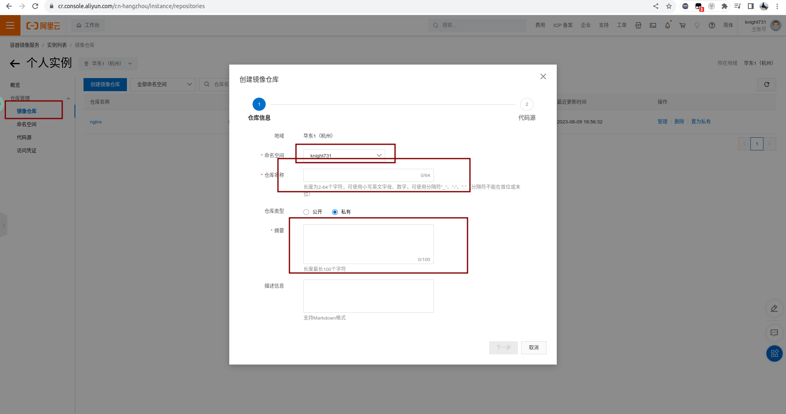
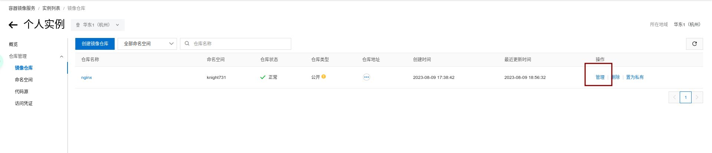
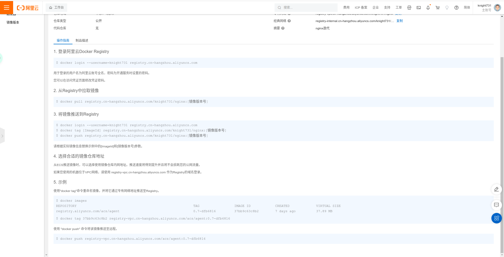

在自己本地生产需要的Docker镜像，只留在本地只能供自己使用，而在团队协作的过程中，更多的要发挥文件共享的优势，那么就需要把Docker镜像推送到远端仓库，作为一个共享的资源。Docker Hub 确实是一个不错的工具，但是作为国内用户来讲，不是很友好，那么在阿里云迅猛发展的今天，也给我们提供了不错的解决方案。所以，最后决定把阿里云仓库作为docker镜像的选择。

### 操作步骤

1. 需要拥有一个阿里云旗下的一个账号，支付宝，淘宝等等都可以。浏览器搜索`aliyun.com`。

<!-- more -->

2. 登录完成后，进入容器镜像服务。



3. 实例列表选择个人版，进入后创建命名空间。



4. 然后创建镜像仓库。



5. 创建完成后，点击镜像仓库右侧的管理。



6. 这里面是可能会用到的命令。



7. 附上自己的仓库，纯粹为了方便自己。

* 登录阿里云Docker Registry：

```bash
docker login --username=knight731 registry.cn-hangzhou.aliyuncs.com
```

* 从Registry中拉取镜像:

```bash
docker pull registry.cn-hangzhou.aliyuncs.com/knight731/nginx:[镜像版本号]
```

* 将镜像推送到Registry:

```bash
docker login --username=knight731 registry.cn-hangzhou.aliyuncs.com
```

```bash
docker tag [ImageId] registry.cn-hangzhou.aliyuncs.com/knight731/nginx:[镜像版本号]
```
 
```bash
docker push registry.cn-hangzhou.aliyuncs.com/knight731/nginx:[镜像版本号]
```