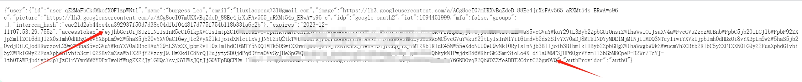
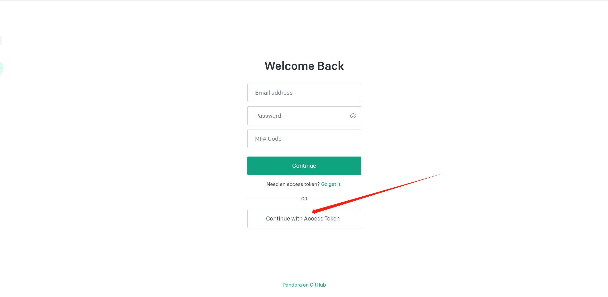
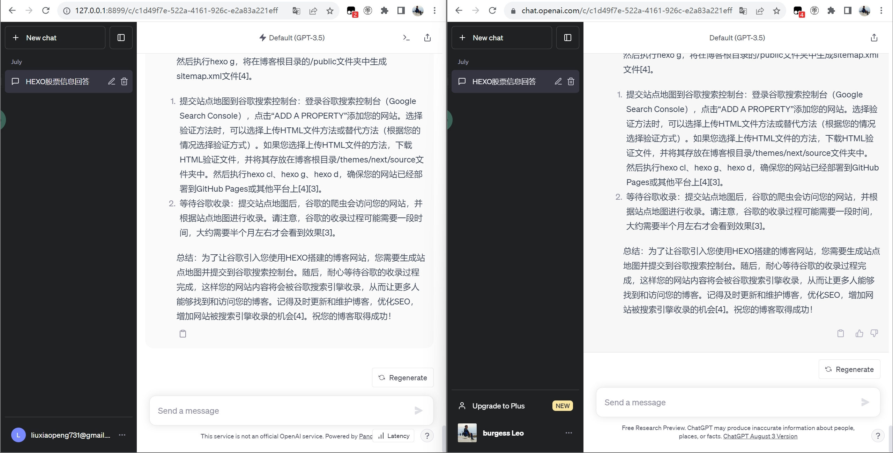

在偶然的机会看到一个不错的项目，可以利用docker搭建一个能在本地跑的chatGPT，速度出奇地快，而且和真实chatGPT的数据是一模一样的，实测很nice，可以搞。

<!-- more -->

### 搭建步骤

1. 自行解决docker环境。

2. 拉取镜像。

```bash
docker pull pengzhile/pandora
```

3. 运行容器。

```bash
docker run  -e PANDORA_CLOUD=cloud -e PANDORA_SERVER=0.0.0.0:8899 -p 8899:8899 -d pengzhile/pandora
```

4. 运行成功就可以在浏览器输入`127.0.0.1:8899`进行访问了。输入自己的chatGPT的账号，就可以正常登录，或者可以通过`token`的方式进行登录。

获取`token`的方法：   
1. 正常登入到chatGPT的页面。
2. 点击获取`token`的链接，[**链接在此**](http://chat.openai.com/api/auth/session)
3. 随后就会出现如下这样的json串，只需要截取箭头位置（括号里）的`token`值即可。



4. 在登录时，选择下方的accesstoken进行登录，然后把token值粘贴进文本框确认即可。



5. 最终的效果图，左边是docker环境下的chatGPT，右边是OpenAI的chatGPT。

