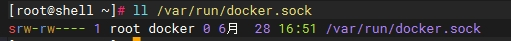

这是面试的时候面试官问我的问题，使用root用户直接登录系统，学习Docker技术确实是比较方便的。但是在生产环境中，大家都知道使用root用户会带来很多问题，而普通用户是不能直接使用docker命令的。下面是配置普通用户使用Docker命令的步骤：

### 创建Docker 用户组

```bash
groupadd docker
```

<!-- more -->

一般来讲安装Docker的时候都会自动创建docker用户组，如果没有Docker组，还是手动创建一下。

### 将用户添加到docker组中

```
gpasswd -a ${USER} docker
```

上面的命令是将当前用户添加到docker组中，如果要添加其他用户，则将${USER}替换成其他用户名。

### 核心思想

Docker运行时使用到`/var/run/docker.sock`文件，要确保这个文件的属组是docker，这样才能保证docker组的用户可以使用docker命令。



**当然如果将这个文件的other部分的权限改成可读写，也可以让非docker组的用户使用docker命令，不过不建议这么做**。