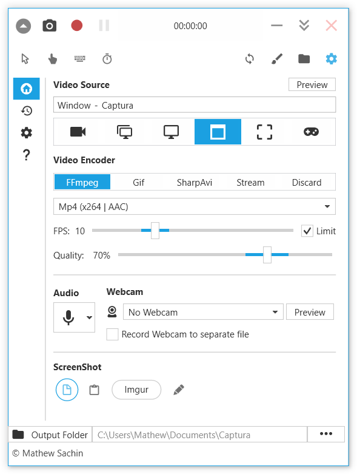

本文旨在收集实用、安全、免费、有趣的开源项目或软件。

<!-- more -->

### Windows调优区

* **[Optimizer](https://github.com/hellzerg/optimizer)**

堪称是Windows 系统上最好用的性能优化器！

   

* **[SophiApp](https://github.com/wangshusen/SearchEngine)**

一款强大的 Windows 微调工具。这是一个用于微调 Windows 10 和 Windows 11 配置的调整器。它拥有现代化的操作界面，在保证系统稳定的前提下，提供了超过 130 种的调整选项。

   

* **[ExplorerPatcher](https://github.com/valinet/ExplorerPatcher)**

自由切换Windows11 开始菜单样式的工具。这是一款能够让Windows 11 的开始菜单栏(Explorer) 重回Windows 10 样式的扩展工具，除此之外还支持禁用Windows 11 的上下文菜单和命令栏等功能，让你在Windows 上拥有更舒适的工作环境。

* **[memreduct](https://github.com/henrypp/memreduct)**

内存自动优化清理，轻量级实时内存管理应用程序，用于监视和清理计算机上的系统内存。

	

### Windows实用区

* **[Everything](https://www.voidtools.com/zh-cn/)**

本地文件搜索工具，属于本人装机必备的软件。

	

* **[Geek](https://geekuninstaller.com/)**

高效快速、小巧便携。100% 免费的Windows卸载工具，同时在卸载之后会自动清理注册表缓存，也属于我的装机必备软件。

  

* **[potplayer视频播放器](https://potplayer.daum.net/)**

本人一直在用的视频播放器软件，几乎是装机必备的软件，功能很强大，唯一的缺点是只支持Windows系统。

	

* **[VLC视频播放器](https://www.videolan.org/vlc/)**

VLC 是一款免费、自由、开源的跨平台多媒体播放器及框架，可播放大多数多媒体文件，以及各类流媒体协议。可在所有平台运行 - Windows, Linux, Mac OS X, Unix, iOS, Android...   
本人在Ubuntu上就是用的这个。

	

* **[Captura](https://mathewsachin.github.io/blog/2023/04/09/captura-unmaintained.html)**

Captura是一款适用于 Windows 的屏幕捕获（屏幕截图、录制）应用程序，可以捕获屏幕、网络摄像头、音频和击键。它不再维护，但源代码仍然存档在 GitHub 上，有 8k+ star 和 1.5k+ fork。

  

* **[鼠标自动点击器（简单版）](https://github.com/InJeCTrL/ClickRun)** **[鼠标自动点击器（高级版）](https://github.com/taojy123/KeymouseGo)**

可以帮我们自动完成一些机械性重复的工作！

  

* **[server](https://github.com/screego/server/releases/tag/v1.10.0)**

多用户的屏幕分享服务。它可以快速启动一个在线共享屏幕的服务，让用户无需安装任何软件，仅使用浏览器就能分享自己的屏幕画面。项目基于网页实时通信(WebRTC) 实现，由 STUN/TURN 协议完成内网穿透和浏览器端对端的连接，既实用又有源码可以学习。

  

* **[Umi-OCR](https://github.com/hiroi-sora/Umi-OCR)**

OCR图片转文字识别软件，完全离线。截屏/批量导入图片，支持多国语言、合并段落、竖排文字。可排除水印区域，提取干净的文本。基于 PaddleOCR 。基于 PaddleOCR 的 OCR 图片转文字识别软件。完全免费、可离线使用的开源软件，支持截屏识别文字、批量导入图片、横/竖排文字，还可以自动忽略水印区域，适用于 Win10、Win11 操作系统。

  

* **[Gopeed](https://gopeed.com/zh-CN)**

一款支持全平台的下载器。

  

### Windows工作区

* **[视频压缩神器](https://handbrake.fr/)**

HandBrake 是一款由志愿者构建的开源工具，用于将视频从几乎任何格式转换为一系列广泛支持的现代编解码器。转换几乎任何格式的视频，免费和开源多平台（Windows、Mac 和 Linux）。

  

* **[LogicFlow](https://github.com/didi/LogicFlow/)**

是一款流程图编辑框架，提供了一系列 流程图的交互、编辑所必需的功能和简单灵活的节点自定义、插件等拓展机制，方便我们快速在业务系统内满足类流程图的需求。

  

* **[SpleeterGui](https://github.com/boy1dr/SpleeterGui)**

一款Windows 上的音轨分离工具，它是第三方制作的Spleeter 桌面应用，支持中文在内的多国语言，可以将音乐里的人声和乐器声分离，轻松实现提取音乐中的伴奏。

  

### Windows娱乐区

* **[lively](https://github.com/rocksdanister/lively)**

Windows 动态桌面壁纸工具。支持 Windows 用户设置多种动画文件为桌面壁纸的工具，不仅安装简单效果炫酷，而且完全免费。

  

* **[jellyfin](https://github.com/jellyfin/jellyfin)**

这是一款非常优秀的本地媒体库管理工具。完全免费、支持中文、安装简单、跨平台、功能强大的媒体库管理系统。它能把原本躺在文件夹里的视频文件，变成包含封面、描述、评分、演员表等信息的“影碟”，让视频整整齐齐、赏心悦目，还支持视频续播、订阅更新、多端可看，让你可以远离广告优雅地追剧。

* **[calibre](https://github.com/kovidgoyal/calibre)**

一款完全免费开源且功能强大的电子书管理工具。它是集下载、格式转化、制作、管理于一体的电子书工具，比如可以将 txt 文本，转化成包含作者信息和书籍封面的 mobi 文件，制作完成后还可以直接发送到 Kindle 设备上。 支持多种电子书格式，包括EPUB、MOBI、PDF等等。Calibre的功能非常强大，可以帮助用户轻松地管理自己的电子书库，包括添加、删除、重命名和搜索等。此外，它还提供了阅读器功能，用户可以在软件内直接阅读电子书，而不需要另外下载阅读器。你还可以可通过插件/扩展实现更多的功能。

### 极客区

* **[hackingtool](https://github.com/Z4nzu/hackingtool)**

黑客工具全家桶。该项目收录了各种黑客工具，包括破解密码、SQL 注入、钓鱼攻击、XSS、DDos 等。堪称黑客军火库的开源项目啊

  

* **[Rocket.Chat](https://github.com/RocketChat/Rocket.Chat)**

一款可自由定制的企业级开源通信平台源码。用它来可以搭建一个功能丰富的通信平台，可自托管做为 Slack 的开源替代品。支持创建频道、团队和讨论等多种不同功能的群聊，消息支持图片、文件、视频和语音，拥有包括 Windows、Linux、macOS、Android 和 iOS 在内的多种客户端。 如果你需要搭建一个安全加密，且具有高度私密性的通信平台，那么这款开源项目就非常适合你了。

  

* **[vanblog](https://github.com/Mereithhh/vanblog)**

实用的一站式个人博客系统。一款简洁优雅的博客系统，追求极致响应速度和博客体验。快到极致的响应速度，Lighthouse 接近满分。前后台均为响应式，支持 Docker 一键部署。前台为静态页面并支持增量渲染，按需构建更新页面。拒绝花里胡哨的功能，专注于个人博客场景。

[vanblog快速上手](https://vanblog.mereith.com/guide/get-started.html)

  

* **[HWiNFO ](https://www.hwinfo.com/)**

适用于 Windows 和 DOS 的全面硬件分析、监控和报告。坦白说，是一个计算机硬件监测工具，并且可以生成报告保存、最全面的系统审计工具。受到了NASA、AMD、华硕、因特尔、戴尔、技嘉等厂商的一致认可。

  

* **[crystaldiskmark](https://crystalmark.info/en/software/crystaldiskmark/)**

CrystalDiskMark 是一款简单的磁盘基准测试软件。

  

* **[1Panel](https://github.com/1Panel-dev/1Panel)**

现代化、开源的 Linux 服务器运维管理面板

  

### 安卓应用区

* **[organicmaps](https://github.com/organicmaps/organicmaps)**

一款免费、没广告的离线地图应用。适用于旅行者、游客、徒步旅行者和骑行者的Android 和iOS 离线地图应用，它使用OpenStreetMap 数据，支持详细的离线地图、骑行路线、语音导航、等高线、海拔剖面、山峰和坡度等功能。

  

* **[BlackHole](https://github.com/Sangwan5688/BlackHole)**

一款高颜值的音乐播放器应用。该项目是用 Flutter 写的高颜值、无广告、免费音乐播放器，拥有歌词、专辑、艺术家、播放列表、定时关闭等功能，支持 Android、iOS、macOS 系统。

  

### 高阶AI区

* **[OpenCat](https://github.com/PetoiCamp/OpenCat)**

开源的四足机器人宠物框架源码，这是一个基于Arduino 和Raspberry Pi 的四足机器人宠物框架，让你可通过C/C++/Python 编程语言操控四足机器人。该公司生产的迷你机器猫，神似玩具版的波士顿机械狗。

* **[Bringing-Old-Photos-Back-to-Life](https://github.com/microsoft/Bringing-Old-Photos-Back-to-Life)**

通过深度学习修复老照片的工具，由微软开源的深度学习项目，可用于修复破损的老照片，修复效果显著。

  

* **[Final2x](https://github.com/Tohrusky/Final2x/)**

图片放大工具，免费开源，主要是清晰度会提高。

  

* **[AnimatedDrawings](https://github.com/facebookresearch/AnimatedDrawings)**

让画作动起来的AI 项目。这是Meta AI 研究院开源的动画库，它能让你的画作动起来。无论是小朋友画的小人，还是高水平的卡通人物，该项目都能让它们跟着你一起做动作。

  

### 不正经项目区

* **[Wai](https://github.com/DukeLuo/wai)**

一款可以预防颈椎病的项目。这是一个通过非正常的方式，展示历史上的今天和这个季节吃什么果蔬的内容，“强迫”你活动脖子从而实现预防颈椎病的目的。