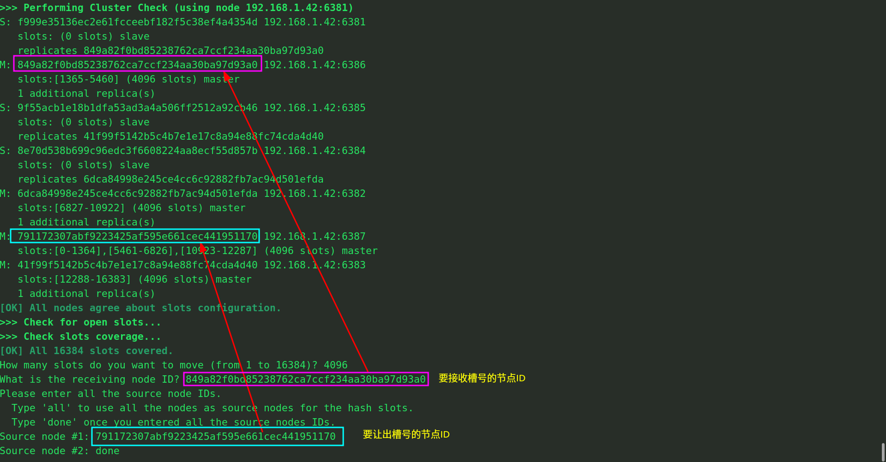

### 操作步骤

要实现Redis缩容，例如移除6387的主机，首先需要把6388的Slave主机移除，然后归还槽位，最后再移除Master主机。

1. 首先查看集群信息

```bash
redis-cli --cluster check 192.168.1.42:6381
```

<!-- more -->

效果：

```bash
S: f999e35136ec2e61fcceebf182f5c38ef4a4354d 192.168.1.42:6381
   slots: (0 slots) slave
   replicates 849a82f0bd85238762ca7ccf234aa30ba97d93a0
M: 849a82f0bd85238762ca7ccf234aa30ba97d93a0 192.168.1.42:6386
   slots:[1365-5460] (4096 slots) master
   1 additional replica(s)
S: 9f55acb1e18b1dfa53ad3a4a506ff2512a92cb46 192.168.1.42:6385
   slots: (0 slots) slave
   replicates 41f99f5142b5c4b7e1e17c8a94e88fc74cda4d40
S: 8e70d538b699c96edc3f6608224aa8ecf55d857b 192.168.1.42:6384
   slots: (0 slots) slave
   replicates 6dca84998e245ce4cc6c92882fb7ac94d501efda
M: 6dca84998e245ce4cc6c92882fb7ac94d501efda 192.168.1.42:6382
   slots:[6827-10922] (4096 slots) master
   1 additional replica(s)
S: 8758dde1064a8fd6aacbc15dfd90d3ca4545cc73 192.168.1.42:6388
   slots: (0 slots) slave
   replicates 791172307abf9223425af595e661cec441951170
M: 791172307abf9223425af595e661cec441951170 192.168.1.42:6387
   slots:[0-1364],[5461-6826],[10923-12287] (4096 slots) master
   1 additional replica(s)
M: 41f99f5142b5c4b7e1e17c8a94e88fc74cda4d40 192.168.1.42:6383
   slots:[12288-16383] (4096 slots) master
   1 additional replica(s)
```

2. 移除6388Slave主机

```bash
redis-cli --cluster del-node 192.168.1.42:6388 8758dde1064a8fd6aacbc15dfd90d3ca4545cc73
```

效果：

```bash
root@knight:/data# redis-cli --cluster del-node 192.168.1.42:6388 8758dde1064a8fd6aacbc15dfd90d3ca4545cc73
>>> Removing node 8758dde1064a8fd6aacbc15dfd90d3ca4545cc73 from cluster 192.168.1.42:6388
>>> Sending CLUSTER FORGET messages to the cluster...
>>> Sending CLUSTER RESET SOFT to the deleted node.
```

3. 再次查看集群的状态信息

```bash
redis-cli --cluster check 192.168.1.42:6381
```

效果：

```bash
S: f999e35136ec2e61fcceebf182f5c38ef4a4354d 192.168.1.42:6381
   slots: (0 slots) slave
   replicates 849a82f0bd85238762ca7ccf234aa30ba97d93a0
M: 849a82f0bd85238762ca7ccf234aa30ba97d93a0 192.168.1.42:6386
   slots:[1365-5460] (4096 slots) master
   1 additional replica(s)
S: 9f55acb1e18b1dfa53ad3a4a506ff2512a92cb46 192.168.1.42:6385
   slots: (0 slots) slave
   replicates 41f99f5142b5c4b7e1e17c8a94e88fc74cda4d40
S: 8e70d538b699c96edc3f6608224aa8ecf55d857b 192.168.1.42:6384
   slots: (0 slots) slave
   replicates 6dca84998e245ce4cc6c92882fb7ac94d501efda
M: 6dca84998e245ce4cc6c92882fb7ac94d501efda 192.168.1.42:6382
   slots:[6827-10922] (4096 slots) master
   1 additional replica(s)
M: 791172307abf9223425af595e661cec441951170 192.168.1.42:6387
   slots:[0-1364],[5461-6826],[10923-12287] (4096 slots) master
M: 41f99f5142b5c4b7e1e17c8a94e88fc74cda4d40 192.168.1.42:6383
   slots:[12288-16383] (4096 slots) master
   1 additional replica(s)
```

可以看到只有3个Slave主机了。

4. 重新分配槽号

```bash
redis-cli --cluster reshard 192.168.1.42:6381
```

要删除的是6387的Master主机，要把6387拥有的槽号统一分配给6386的Master主机，按照下图的指示进行操作：



5. 稍作等待，待槽号重新分配完成，查看集群节点的槽号信息

```bash
redis-cli --cluster check 192.168.1.42:6381
```

效果：

```bash
root@knight:/data# redis-cli --cluster check 192.168.1.42:6381
192.168.1.42:6386 (849a82f0...) -> 0 keys | 8192 slots | 1 slaves.
192.168.1.42:6382 (6dca8499...) -> 1 keys | 4096 slots | 1 slaves.
192.168.1.42:6387 (79117230...) -> 0 keys | 0 slots | 0 slaves.
192.168.1.42:6383 (41f99f51...) -> 1 keys | 4096 slots | 1 slaves.
```

可以看到6387的主机已经没有任何槽号了，而6386主机比其他两个Master节点多出来4096个槽号。

5. 从集群删除6387节点

```bash
redis-cli --cluster del-node 192.168.1.42:6387 791172307abf9223425af595e661cec441951170
```

效果：

```bash
root@knight:/data# redis-cli --cluster del-node 192.168.1.42:6387 791172307abf9223425af595e661cec441951170
>>> Removing node 791172307abf9223425af595e661cec441951170 from cluster 192.168.1.42:6387
>>> Sending CLUSTER FORGET messages to the cluster...
>>> Sending CLUSTER RESET SOFT to the deleted node.
```

6. 再次查看集群节点信息

```bash
redis-cli --cluster check 192.168.1.42:6381
```

效果：

```bash
S: f999e35136ec2e61fcceebf182f5c38ef4a4354d 192.168.1.42:6381
   slots: (0 slots) slave
   replicates 849a82f0bd85238762ca7ccf234aa30ba97d93a0
M: 849a82f0bd85238762ca7ccf234aa30ba97d93a0 192.168.1.42:6386
   slots:[0-6826],[10923-12287] (8192 slots) master
   1 additional replica(s)
S: 9f55acb1e18b1dfa53ad3a4a506ff2512a92cb46 192.168.1.42:6385
   slots: (0 slots) slave
   replicates 41f99f5142b5c4b7e1e17c8a94e88fc74cda4d40
S: 8e70d538b699c96edc3f6608224aa8ecf55d857b 192.168.1.42:6384
   slots: (0 slots) slave
   replicates 6dca84998e245ce4cc6c92882fb7ac94d501efda
M: 6dca84998e245ce4cc6c92882fb7ac94d501efda 192.168.1.42:6382
   slots:[6827-10922] (4096 slots) master
   1 additional replica(s)
M: 41f99f5142b5c4b7e1e17c8a94e88fc74cda4d40 192.168.1.42:6383
   slots:[12288-16383] (4096 slots) master
   1 additional replica(s)
```

可以看到集群又恢复到3主3从的节点状态。