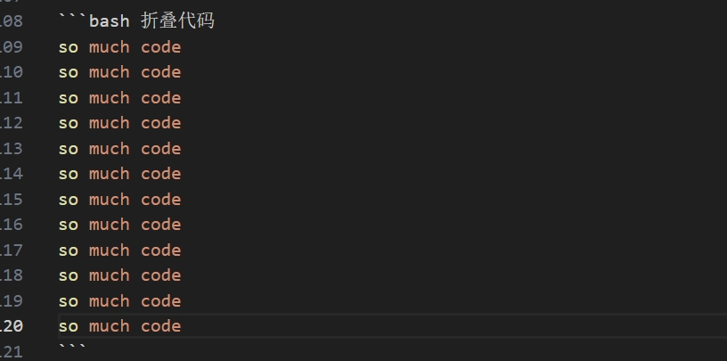
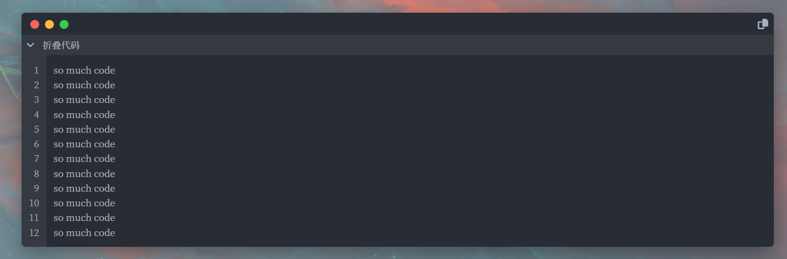

有些时候经常会遇到博客中很长的代码段，占据半个甚至整个屏幕，此时就非常需要将代码段进行折叠，以此来缓解代码块影响阅读的问题。

配置走起！

<!-- more -->

### 配置步骤

1. 取消注释

打开`themes\next\_config.yml`文件。   
<kbd>CTRL</kbd>+<kbd>F</kbd>查找关键字“custom_file_path”(如果你使用的是VS-CODE编辑器)。   
取消`bodyEnd: source/_data/body-end.njk`注释和`style: source/_data/styles.styl`注释。

```yml 折叠代码
custom_file_path:
  #head: source/_data/head.njk
  #header: source/_data/header.njk
  #sidebar: source/_data/sidebar.njk
  #postMeta: source/_data/post-meta.njk
  #postBodyEnd: source/_data/post-body-end.njk
  footer: source/_data/footer.swig
  bodyEnd: source/_data/body-end.njk
  variable: source/_data/variables.styl
  #mixin: source/_data/mixins.styl
  style: source/_data/styles.styl
```

2. 按照`style`的路径和`bodyEnd`的路径添加相应的文件，如果当前不存在此文件的话。如果已经存在的话，添加以下配置。

* 首先添加`bodyEnd`文件的内容

```js 折叠代码
<script>
  document.addEventListener("DOMContentLoaded", function() {
    // 查找所有 div.table-container 元素
    const tableContainers = document.querySelectorAll(".table-container");

    // 遍历所有 div.table-container 元素
    tableContainers.forEach(function(tableContainer) {
      // 获取 div.table-container 内的 span 元素数量
      const spanCount = tableContainer.querySelectorAll("tbody > tr > td.code > pre > span").length;

      // 检查 span 元素数量是否 >= 11
      if (spanCount >= 11) {
        // 检查 div.table-container 前面是否有 figcaption 元素，如果没有则添加一个
        const prevElement = tableContainer.previousElementSibling;
        let figcaption;
        let iElement;
        if (!prevElement || prevElement.tagName.toLowerCase() !== "figcaption") {
          // 在 div.table-container 前插入一个 figcaption 元素
          figcaption = document.createElement("figcaption");

          // 将 figcaption 插入到 DOM 中
          tableContainer.parentNode.insertBefore(figcaption, tableContainer);
        } else {
          figcaption = prevElement;
        }

        // 创建一个 <i> 标签并添加功能
        iElement = document.createElement("i");
        iElement.className = "fas fa-angle-down";
        // 插入一点空格
        iElement.innerHTML = "&nbsp;&nbsp;&nbsp;";
        figcaption.insertBefore(iElement, figcaption.firstChild);

        // 为 <i> 标签添加点击事件
        iElement.addEventListener("click", function() {
          // 切换 tableContainer 的 "code-hidden" 类
          tableContainer.classList.toggle("code-hidden");

          // 切换 <i> 标签的类名
          if (iElement.classList.contains("fa-angle-down")) {
            iElement.classList.remove("fa-angle-down");
            iElement.classList.add("fa-angle-right");
          } else {
            iElement.classList.remove("fa-angle-right");
            iElement.classList.add("fa-angle-down");
          }
        });
      }
    });
  });
</script>
```

PS：在代码的第11行，可以按照自己的需要进行设置，当代码超过多少行时，折叠代码的JS生效。

* 然后修改`style`文件内容，在文件的末尾添加：

```yml
/* 代码块隐藏 */
.code-hidden {
    display: none;
}
```

* 使用案例

代码图：



效果图：



### 补充

已经取消注释的文件对应的功能和教程链接。

|文件|功能|
|:---:|:---:|
|footer|**[背景"小飞棍"](https://nustarain.gitee.io/2023/07/17/FlyLine/)**|
|bodyEnd|**[折叠代码](https://nustarain.gitee.io/2023/09/09/blog-FoldCode/)**|
|variable|**[设置圆角](https://nustarain.gitee.io/2023/09/09/blog-fillet/)**|
|style|**[背景图片](https://nustarain.gitee.io/2023/07/17/BGPic/)**、**[博客透明度](https://nustarain.gitee.io/2023/09/09/blog-transparency/)**、**[折叠代码](https://nustarain.gitee.io/2023/09/09/blog-FoldCode/)**|