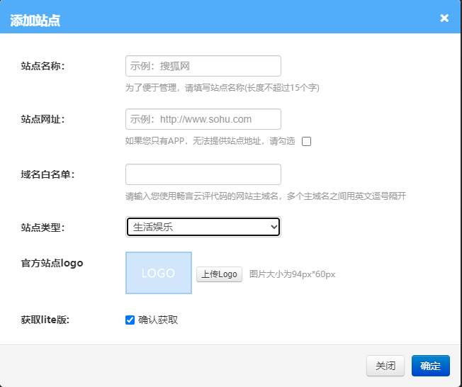
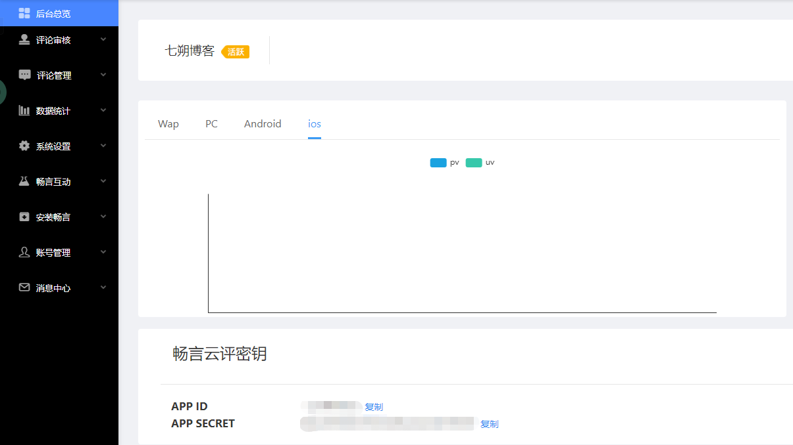
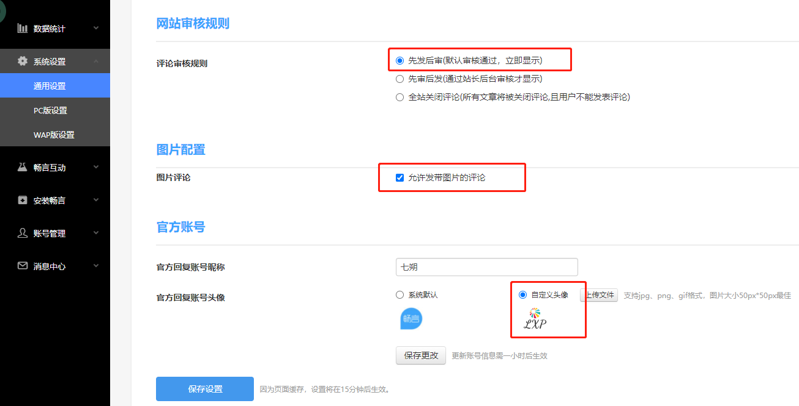
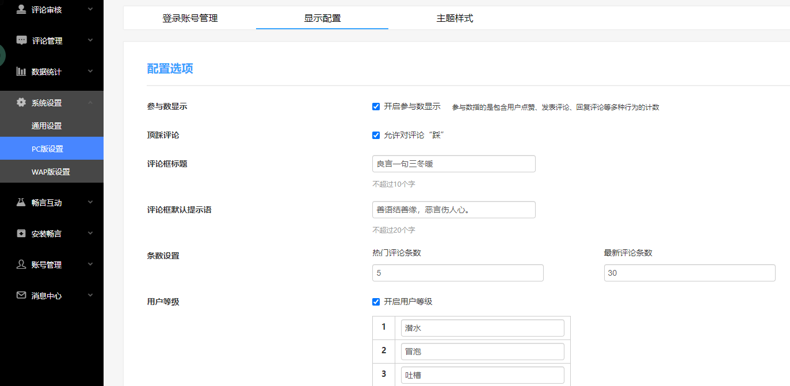
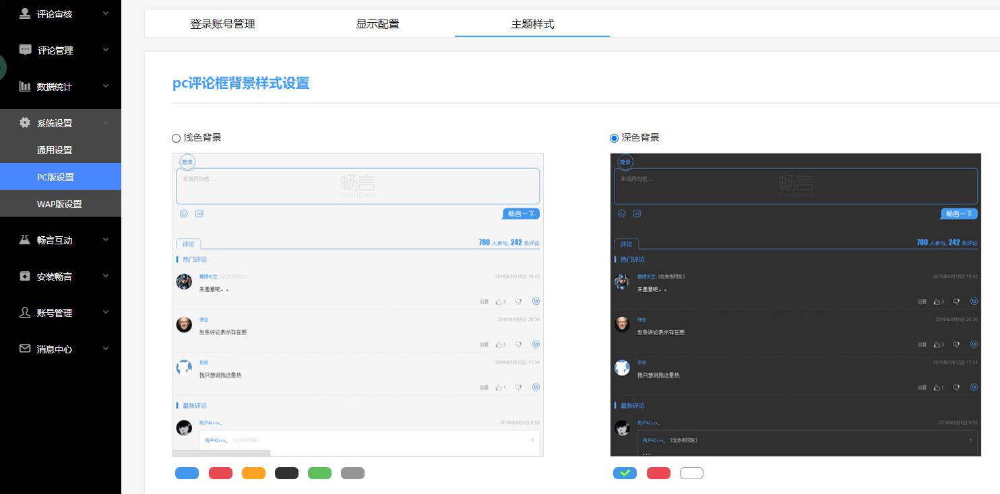

### 搭建原因

之前在博客搭建了评论的板块，但是因为使用的是gitalk的评论功能，如果访客要进行评论的话，首先必须拥有一个github的账号，但绝大多数人如果不做这一行，不向开发靠拢，就很大程度上没有github的账号。基于这样的原因，我又重新寻找评论的插件，终于找到了适合国人的评论插件“畅言”。畅言是支持手机号、QQ账号、微信账号登录使用的，很符合我的需求，于是简单了解了一下搭建的方法，在这里分享给大家。

### 条件准备

1. 使用畅言评论，我们首先要去[畅言评论官网](https://changyan.kuaizhan.com/)注册一个账号。

<!-- more -->

紧接着我们需要添加一个站点，按照要求来就OK。站点名称随便输入，网址是你的网站的域名，白名单选填，直接跳过就OK，站点类型按照下拉框选择就好，网站logo有就添加，没有可以不添加。总的来讲，只有站点网站这一个框比较重要。



2. 找到ID和SECRET。

注册好之后，在后台总览可以找到这两个参数，这两个参数待会还有别的用处。



3. 修改NEXT的主题配置文件。

将comment的active值修改为changyan。

```yml
comments:
  # Available values: tabs | buttons
  style: tabs
  # Choose a comment system to be displayed by default.
  # Available values: disqus | disqusjs | changyan | livere | gitalk | utterances
  active: changyan
```

然后进行changyan的主配置修改，将enable值改为true，下面的appid和appkey对应畅言官网的APP ID和APP SECRET。

```yml
changyan:
  enable: true # false
  appid: c*******s
  appkey: 48a****b8**2328cd*****ab****50d7
  # Show comments count
  count: true
```

修改完成后，可以在博客上看到畅言评论的评论区了，如下图所示：


4. 对评论区的功能进行更多的设置。

可以在主页系统设置的通用设置里设置审核规则，是否允许用图片进行评论，官方回复使用的昵称和头像。



可以在主页系统设置的PC版设置里的显示配置，进行评论区的显示配置。



还可以设置主题的样式。

