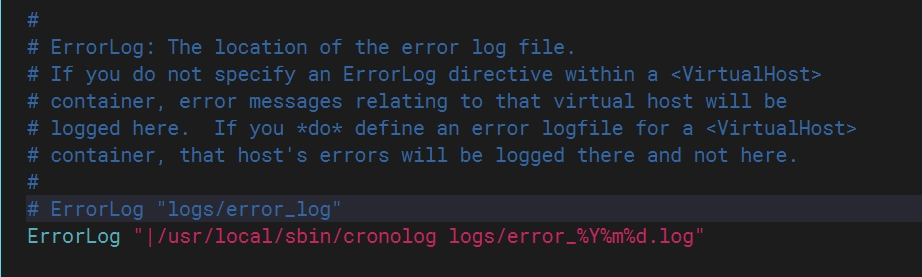
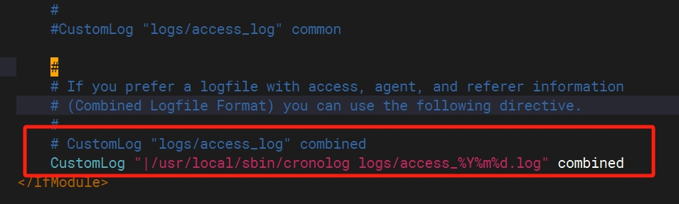
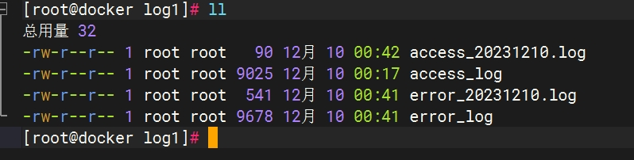

### 为什么要进行日志切割

日志切割是为了解决日志文件过大导致的一些问题，具体好处如下：

* **控制日志文件大小**： 避免单个日志文件不断增大，占用过多磁盘空间。大日志文件不仅消耗磁盘空间，还可能导致文件系统性能下降。

<!-- more -->

* **方便管理和维护**： 日志切割可以将日志文件按照一定的规则划分成多个较小的文件，便于管理和维护。这样，每个日志文件都包含了特定时间范围或大小的日志，有助于快速定位和查找问题。

* **避免日志文件过大导致的性能问题**： 当一个日志文件变得非常庞大时，对于日志分析工具或其他需要读取该文件的应用，可能会导致性能下降。切割日志文件可以降低读取和处理的负担。

* **支持日志轮转**： 日志切割通常与日志轮转（log rotation）结合使用。日志轮转是指将旧的日志文件备份并可能删除，以便为新的日志文件腾出空间。这有助于保留最近的日志记录，同时控制总体日志文件数量。

* **方便归档和备份**： 切割的日志文件可以更容易地进行归档和备份，因为每个文件的大小和时间范围都是可控的。

* **提高日志的可读性**： 日志切割可以根据需要将日志文件按照不同的标准（例如按天、按大小）进行划分，使得每个文件包含的日志更加具有一致性，提高了日志的可读性和可搜索性。

### 安装 cronolog 工具

1. 下载源码包

```bash
wget https://files.cnblogs.com/files/crazyzero/cronolog-1.6.2.tar.gz
```

2. 解压并进入

```bash
tar -zxvf cronolog-1.6.2.tar.gz
cd cronolog-1.6.2/
```

3. 编译安装

```bash
./configure 
make
make install
```

4. 验证

```bash
[root@VM-0-10-centos sbin]# which cronolog
/usr/local/sbin/cronolog
```

### 示例

以对 Apache 进行日志切割进行演示，进入 Apache 主配置文件，更改`ErrorLog`和`CustomLog`两个选项。

* 将`ErrorLog "logs/error_log"`注释，在下面加上一行

```bash
ErrorLog "|/usr/local/sbin/cronolog logs/error_%Y%m%d.log"
```

效果如下：



* 将`CustomLog "logs/access_log" combined`注释，在下面加上一行

```bash
CustomLog "|/usr/local/sbin/cronolog logs/access_%Y%m%d.log" combined
```

效果如下：



### 验证

配置完成之后，使用`httpd -t`检查 Apache 语法，检查无误，使用`apachectl graceful`重新启动服务。

之后在`/var/log/httpd`目录下就可以看到例如 error_20231210.log 这样的 log 文件，然后使用 curl 命令或者浏览器重新访问网站就会自动生成 access_20231210.log 这样的文件。



### 写在后面的话

以上就可以实现访问日志和错误日志以天为单位进行切割保存，当然 cronolog 也支持按照小时进行切割，在双十一或者春运等特殊日期某访问量突然增多的情况下，可以按照小时进行切割。