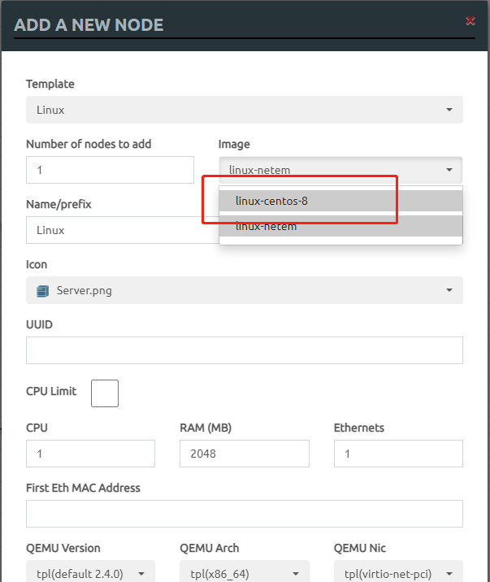
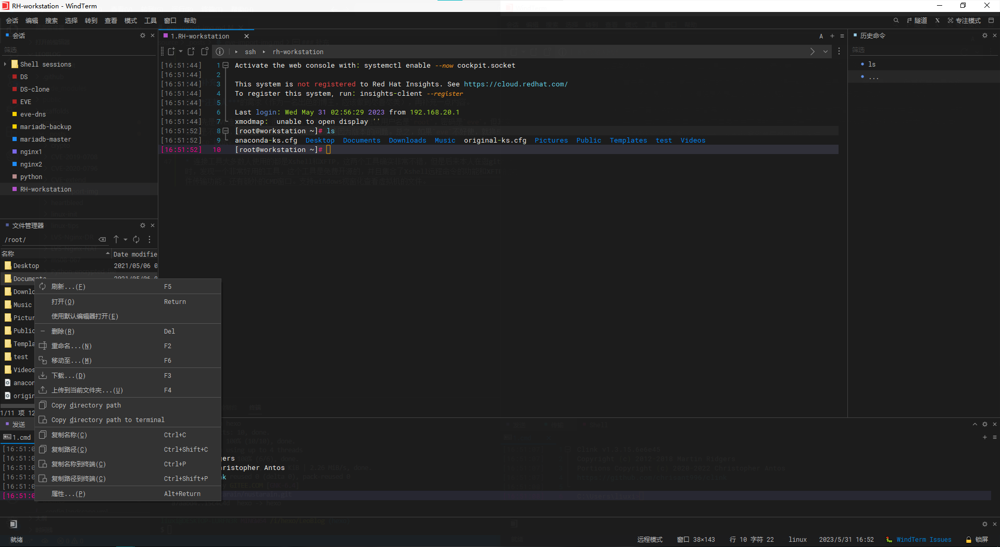

最近做python的三级项目，需要在EVE里面使用服务器的节点，因为EVE是不自带相关镜像的，只能通过自己导入的方式，全网的教程层出不穷，在借鉴学习了几篇文章后，简明精要的做出一下总结。

### 前期准备

首先需要EVE的导入镜像，我只用到了CENTOS8的，[相关链接](https://pan.baidu.com/s/14OK6FP1sUPU5KDQHexRLbA) 放在了云盘里，提取码：0731，需要自取。虚拟机的`user`用户和`root`密码均为`Test123`。

<!-- more -->

### 操作步骤

1. 使用文件传输工具将镜像导入到eve的虚拟机里面，上传路径为`/opt/unetlab/addons/qemu/`

2. 接着使用命令解压这个文件

```bash
tar -xf linux-centos-8.tgz
```

3. 执行命令修正权限。

```bash
/opt/unetlab/wrappers/unl_wrapper -a fixpermissions
```

>修正权限我也不知道不进行这步会报什么错，我没进行这步也能正常使用，总之，如果没有进行这步，然后遇到什么问题，不妨回来补一下这个操作。

4. 最后大功告成，在EVE网页中可以使用了(鼠标右击-->node-->linux-->image)。



---

### 补充

应***汪某人***的需求（作为一名出色的博主，应该做到尽善尽美），再补充一点内容。

* 首先是EVE连接时有一个很坑的点，虚拟机打开时提示默认用户名是`root`，密码是`eve`。但其实密码是不对的，密码是`cisco`。不清楚是不是因为版本的问题。总之，如果`eve`不好使，就换成`cisco`试试。

* 连接工具大多数人使用的都是Xshell和XFTP，这两个工具确实非常不错，但是后来本人在逛github时，发现一个非常好用的工具，这个工具是免费开源的，并且集合了Xshell远程命令的功能和XFTP的文件传输功能，还有额外的CMD窗口。支持windows视窗化查看虚拟机的文件。截图如下，[链接在这](https://github.com/kingToolbox/WindTerm/releases/download/2.5.0/WindTerm_2.5.0_Windows_Portable_x86_64.zip) 。



