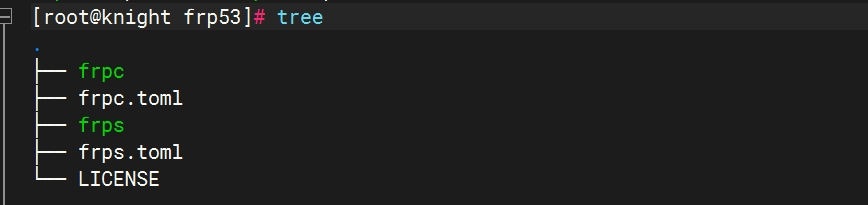
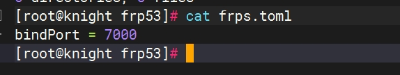
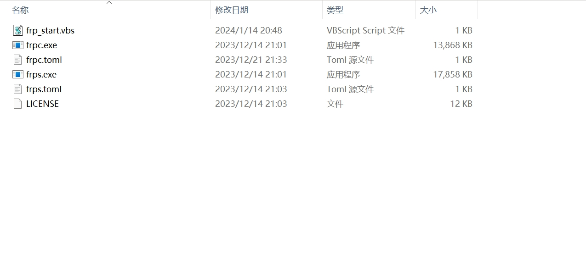
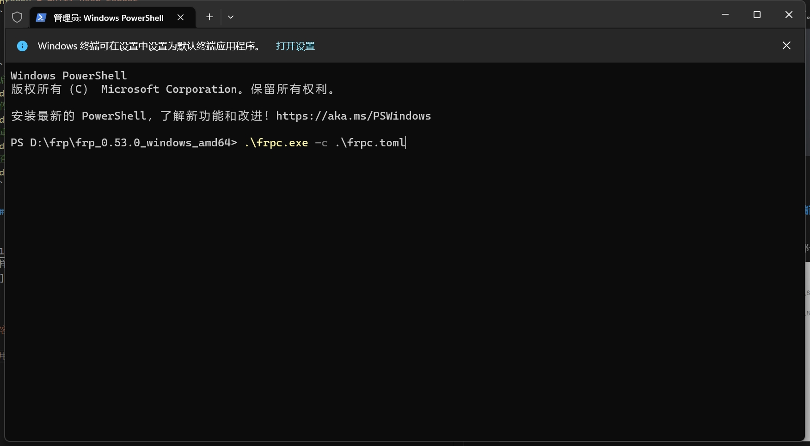
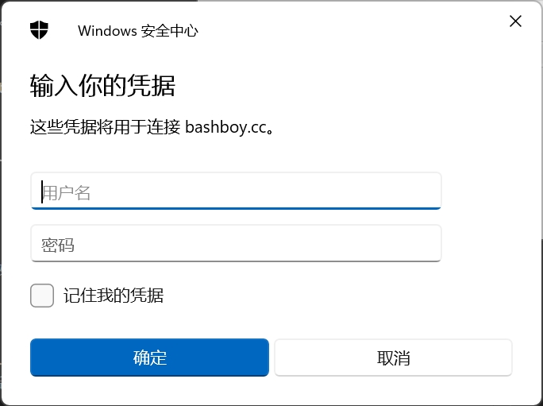

最近入手了一台VPS，针对VPS进行了一些功能探索。所以此教程是需要基于一台VPS的。类似于向日葵和 To Desk 的远程桌面，只不过 FRP 实现的远程桌面不需要你再去记住远程软件提供的控制码。

<!-- more -->

### 啰嗦几句

FRP 的安装分为服务器端和客户端。服务器端需要在 VPS 上安装，客户端需要在本地安装（也就是需要被远程连接的机器）。

此项目也是Github上的项目，[项目链接 https://github.com/fatedier/frp](https://github.com/fatedier/frp)

### 服务器端安装 FRP

直接使用下面的命令

```bash
wget https://github.com/fatedier/frp/releases/download/v0.15.1/frp_0.15.1_linux_amd64.tar.gz
```
下载好后压缩包后解压，会得到以下几个文件



* frpc 是客户端运行的可执行文件，VPS这里不需要理它。
* frpc.toml 是客户端的配置文件，VPS这里不需要理它。
* frps 是服务端运行的可执行文件，VPS要用
* frps.toml 是服务端的配置文件，VPS要用。

### 修改服务端配置文件frps.toml

```toml
bindPort = 7000
```

]

修改后运行如下命令启动服务：

```bash
frps -c ./frps.toml
```

运行后，会有输出内容，这是问题就出现了，不能<kbd>Ctrl</kbd> + <kbd>C</kbd>停止掉，这就造成当前运行服务后不能进行其他操作了。所以需要把服务做成后台服务，这样就可以在前台进行其他操作了。

如果访问Github有困难的话，可以去百度网盘下载，我使用的是0.53.0版本，提供的也是0.53.0版本。[**服务器端百度网盘链接，点击跳转，**](https://pan.baidu.com/s/1eTxV0C_ApwfWivirMB6zIg?pwd=wzns) 提取码：wzns

### 使用 systemctl 管理 FRP 服务

首先放一个官方链接，[**点击跳转。**](https://gofrp.org/zh-cn/docs/setup/systemd/)

1. 安装 systemd

如果您的 Linux 服务器上尚未安装 systemd，可以使用包管理器如 yum（适用于 CentOS/RHEL）或 apt（适用于 Debian/Ubuntu）来安装它：

```bash
# 使用 yum 安装 systemd（CentOS/RHEL）
yum install systemd

# 使用 apt 安装 systemd（Debian/Ubuntu）
apt install systemd
```

2.创建 frps.service 文件

使用文本编辑器 (如 vim) 在 /etc/systemd/system 目录下创建一个 frps.service 文件，用于配置 frps 服务。

```bash
sudo vim /etc/systemd/system/frps.service
```

3. 写入内容

```bash
[Unit]
# 服务名称，可自定义
Description = frp server
After = network.target syslog.target
Wants = network.target

[Service]
Type = simple
# 启动frps的命令，需修改为您的frps的安装路径
ExecStart = /path/to/frps -c /path/to/frps.toml

[Install]
WantedBy = multi-user.target
```

4. 然后就可以像管理其他服务一样，使用systemctl命令来管理frps了。

```bash
# 启动frp
sudo systemctl start frps
# 停止frp
sudo systemctl stop frps
# 重启frp
sudo systemctl restart frps
# 查看frp状态
sudo systemctl status frps
```

### 客户端（Windows）安装FRP

[0.53.0官方Windows下载链接，点击下载](https://github.com/fatedier/frp/releases/download/v0.53.0/frp_0.53.0_windows_amd64.zip)   
同样的，访问Github有困难的话，可以使用百度网盘下载，[**客户端百度网盘链接，点击跳转**](https://pan.baidu.com/s/11-wDw4l_augPWeAf9OcTGA?pwd=kstm) 提取码：kstm

### 客户端配置文件修改

下载解压后，除了你们没有如图所示的第一个文件外，其他应该都一样。



```toml
serverAddr = "123.56.10.1"  # 服务器地址，填写自己真实的VPS地址
serverPort = 7000           # 服务器端口，与服务端配置的端口一致

[[proxies]]
name = "HP-desktop"         # 备注，随便写
type = "tcp"                # 类型，不要变
localIP = "127.0.0.1"       # 不要变
localPort = 3389            # 本地端口，不要变
remotePort = 10086          # 远程端口，自己设，比如设置为10086，以后访问这台Windows就是输入123.56.10.1:10086。
```

使用起来是和服务器端一样的，只不过这次需要运行客户端的文件。在当前目录鼠标右击打开CMD，然后如图所示运行（一定要看清楚运行的是 **frpc** 的文件）。



### 设置Windows无窗口启动

这也就是为什么我会多出来一个.vbs文件。话不多说，放码出去。

```vbs
Set WShell = CreateObject("WScript.Shell")
command = "frpc.exe"
arguments = "-c frpc.toml"
fullCommand = command & " " & arguments
WShell.Run fullCommand, 0, False
Set WShell = Nothing
```

想启动服务直接双击这个.vbs文件即可，如果想达到开机自启动，可以将这个.vbs文件放到开机计划中。

1. 首先创建好快捷方式。
2. <kbd>Win</kbd>+<kbd>R</kbd>输入`shell:startup`，直接回车。
3. 将快捷方式放入这个文件夹中，大功告成。

### 测试

<kbd>Win</kbd>+<kbd>Q</kbd>搜索“远程桌面连接”，输入IP以及端口号，如果没毛病的话，就是如下的效果。如果有什么问题，可以评论区留言。



最后输入被控电脑的用户名和密码进行登录。

---
---

### 易错点

1. 以上面的教程为例，VPS 是需要打开 7000 端口和 10086 端口的，放行这两个端口，否则无法连接。

2. Windows 家庭版无法使用远程桌面，要么重新安装 Windows 专业版，要么使用专业版激活码重新激活。