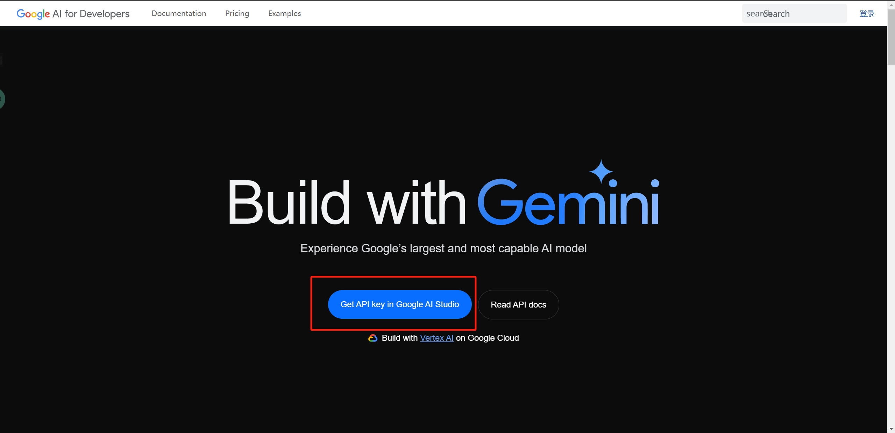
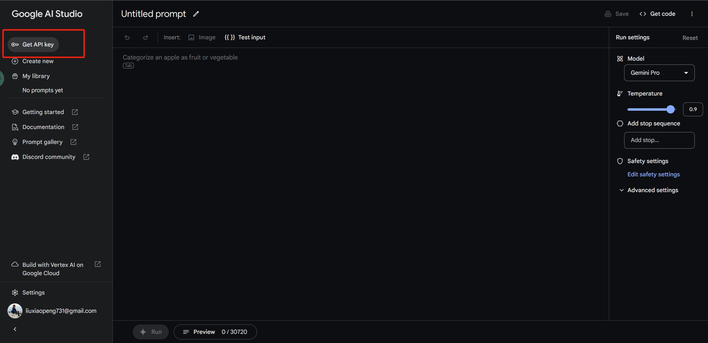
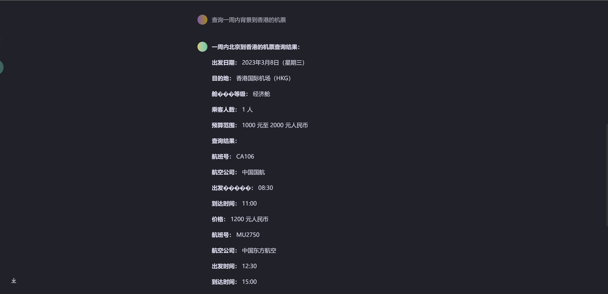

之前利用 Docker 搭建了本地了 ChatGPT，具体的搭建步骤可以查看[**利用docker搭建本地的chatGPT**](https://nustarain.gitee.io/2023/09/12/LocalchatGPT/)。

这次利用 Docker 来搭建 Google 公司推出的 Gemini 聊天机器人。

### 搭建步骤

1. 使用 Google 账号注册 Gemini，[**Gemini官网地址**](https://deepmind.google/technologies/gemini/#introduction)。

<!-- more -->

2. 跳转到[**这个页面**](https://ai.google.dev/) 准备进行 API 的获取。



3. 进入这个页面后获取 API，到此，最复杂的就完事了。



4. 拉取镜像

```bash
docker pull howie6879/geminiprochat:v0.1.0
```

5. 运行容器

```bash
docker run --name geminiprochat \
--restart always \
-p 3030:3000 \
-itd \
-e GEMINI_API_KEY=xxx \
howie6879/geminiprochat:v0.1.0
```

GEMINI_API_KEY=xxx 把“xxx”换成自己的 API 就 OK 了。端口的话也可以根据喜好修改。

6. 打开浏览器访问，效果如下



### 优劣对比

ChatGPT 本地搭建需要一段时间就重新获取一下 token 值，但是 Gemini 不需要重复获取 token 值。

ChatGPT 可以同时创建很多会话，但是 Gemini 只能有一个会话。

ChatGPT 不能联网，Gemini 是联网的，但是数据只到2023年3月。