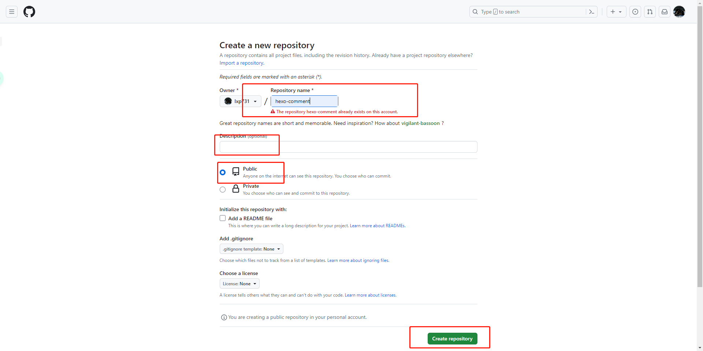
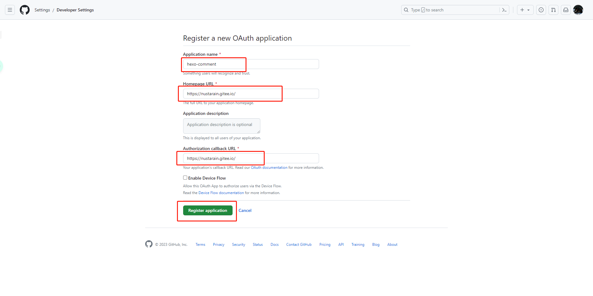
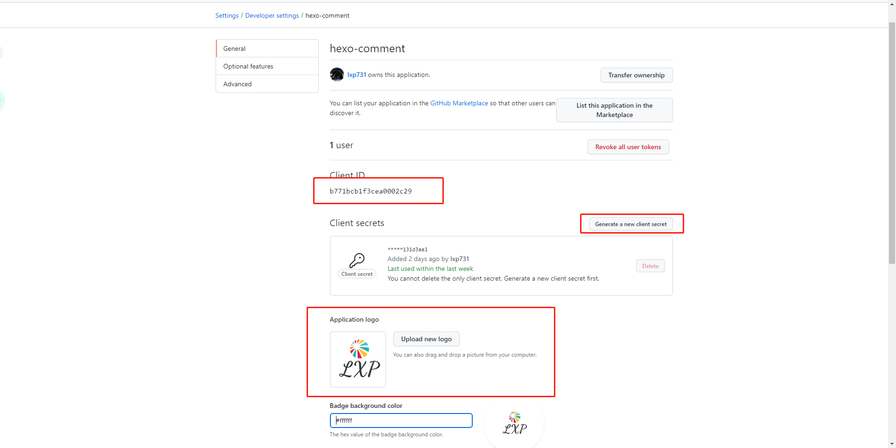

### 背景介绍

自己一味的输出，倘若收不到别人的反馈，自己也是不会进步的，博客的质量也就只会在当前的水平停止不前，在这样的影响下，我决心要给博客打造一个评论系统，于是我花了点时间深入研究了博客的评论的系统搭建。

最初，我选择的是github的gitalk。

### 环境说明

我的博客基于hexo，使用的是next主题，这个主题安装之后，在主题的配置文件中，默认存在几个关于评论的系统板块，我们只要针对gitalk这个板块编辑就OK。

<!-- more -->

### 创建仓库

1. 直接在github首页创建一个仓库，用来存储博客的评论，相当于一个数据库的作用。

* 首先填写一个仓库名字，下面报红是因为我已经创建过一个了。
* 仓库描述的话选填，可写可不写。
* 选择为public。
* 最后点击创建仓库。



2. 除了建仓库，还需要注册一个应用。[官方注册地址](https://github.com/settings/applications/new)。

* Application name填写的还是一个应用程序的名字，这里我填写的和仓库的名字保持一样了，你们按照喜好来就OK。
* Homepage URL然后填写的是你的网站域名。
* Application description接下来又是一个描述类的信息，选填。
* Authorization callback URL这里同样填写你网站的域名。
* 最后注册应用程序等待完成就好。



3. 创建完成后，默认会进入应用程序，接下来要完成一个秘钥的生成。

* Client ID默认会存在。这个待会还会用到。
* 默认是不存在密钥的，要点击生成秘钥，生成之后要立刻复制下来，因为保存或者离开页面就变成图例这样了。这个待会还会用到。
* logo可以自己设计一个，感觉蛮不错的。
* 都设置完之后点击最下面的Update Application。



后期如果需要对应用程序进行一些修改，可以依次到github头像-->setting-->Developer Settings-->OAuth Apps进行修改。

### 修改配置文件

修改配置文件的部分，进入博客主目录，`vim themes/next/_config.yml`

1. 首先需要把`active`的值，改为gitalk

```yaml
comments:
  # Available values: tabs | buttons
  style: tabs
  # Choose a comment system to be displayed by default.
  # Available values: disqus | disqusjs | changyan | livere | gitalk | utterances
  active: gitalk
  # Setting `true` means remembering the comment system selected by the visitor.
  storage: true
  # Lazyload all comment systems.
  lazyload: false
  # Modify texts or order for any naves, here are some examples.
  nav:
    #disqus:
    #  text: Load Disqus
    #  order: -1
    #gitalk:
    #  order: -2
```

2. 然后往下滑，找到gitalk的模块。

  * enable的值设置为true，表示启用。
  * github_id表示你的github的账号。
  * repo，填写用来存储评论的仓库。
  * client_id之前创建的ID。
  * client_secret之前创建好的口令。
  * admin_user这个是管理员的账户，也就是你自己的github账号。
  * distraction_free_mode默认就好。
  * proxy代理值，默认就好。
  * language语言类型，别的地方我不管，在我这里必须讲中文。

```yaml
gitalk:
  enable: true
  github_id: lxp731 # GitHub repo owner
  repo: hexo-comment # Repository name to store issues
  client_id: b771bc******0002c29 # GitHub Application Client ID
  client_secret: e87e6******531007231*******5ab3c131d3aa1 # GitHub Application Client Secret
  admin_user: lxp731 # GitHub repo owner and collaborators, only these guys can initialize gitHub issues
  distraction_free_mode: true # Facebook-like distraction free mode
  # When the official proxy is not available, you can change it to your own proxy address
  proxy: https://cors-anywhere.azm.workers.dev/https://github.com/login/oauth/access_token # This is official proxy address
  # Gitalk's display language depends on user's browser or system environment
  # If you want everyone visiting your site to see a uniform language, you can set a force language value
  # Available values: en | es-ES | fr | ru | zh-CN | zh-TW
  language: zh-CN
  ```