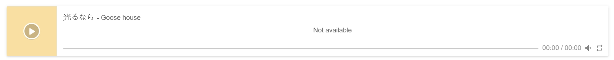
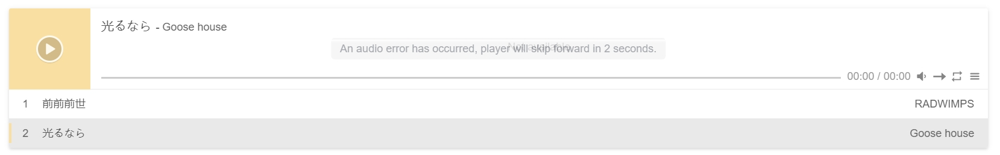
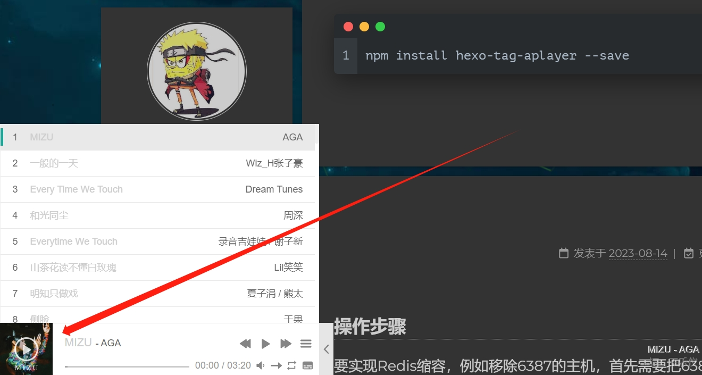

突然的心血来潮想尝试在博客中也可以播放音乐，因为之前也见过大佬的博客有这样的功能，今天抽空研究了一下，没想到竟然成功了，赶紧记录下来。

### 环境准备

1. 安装插件

```bash
npm install hexo-tag-aplayer --save
```

<!-- more -->

要实现博客中添加音乐播放器的方式有两种，第一种配置简单，但是使用麻烦，所以不推荐，第二种配置麻烦，使用简单，所以比较推荐。

### 不推荐使用的方式

1. 安装完成后就可以在markdown页面编辑音乐代码了。

```bash

```

上面的案例基本按照这样的代码格式进行编写：

```bash

```

详细参数如下：

|参数|说明|
|:---:|:---:|
|title|歌曲标题|
|author|歌曲作者|
|url|音乐文件URL地址|
|picture_url|（可选）封面图片地址|
|narrow|（可选）播放器袖珍风格|
|autoplay|（可选）自动播放，移动端浏览器暂时不支持此功能|
|width|（可选）播放器宽度 (默认: 100%)|
|lrc|（可选）歌词文件 URL 地址|

单曲样例：

```bash
{% aplayer 
"光るなら" 
"Goose house" 
"https://cn-south-17-aplayer-46154810.oss.dogecdn.com/hikarunara.mp3" 
"https://cn-south-17-aplayer-46154810.oss.dogecdn.com/hikarunara.jpg" 
"lrc:https://cn-south-17-aplayer-46154810.oss.dogecdn.com/hikarunara.lrc" 
"width:100%" 
%}
```

效果如图：



除了可以添加一首歌曲，还以编辑歌单，代码如下：

```bash 折叠代码

{
    "narrow": false,
    "autoplay": false,
    "mode": "random",//（可选）'random', 'single' (单曲播放), 'circulation' (循环播放), 'order' (列表播放)， 默认：'circulation' 
    "showlrc": 3,
    "mutex": true,
    "theme": "#e6d0b2",
    "preload": "metadata",
    "listmaxheight": "513px",
    "music": [
        {
            "title": "前前前世",
            "author": "RADWIMPS",
            "url": "https://cn-south-17-aplayer-46154810.oss.dogecdn.com/yourname.mp3",
            "pic": "https://cn-south-17-aplayer-46154810.oss.dogecdn.com/yourname.jpg",
            "lrc": "https://cn-south-17-aplayer-46154810.oss.dogecdn.com/yourname.lrc"
        },
        {
            "title": "光るなら",
            "author": "Goose house",
            "url": "https://cn-south-17-aplayer-46154810.oss.dogecdn.com/hikarunara.mp3",
            "pic": "https://cn-south-17-aplayer-46154810.oss.dogecdn.com/hikarunara.jpg",
            "lrc": "https://cn-south-17-aplayer-46154810.oss.dogecdn.com/hikarunara.lrc"
        }
    ]
}

```



歌曲文件，歌曲封面都可以引用本地文件，但是因为音乐，封面，歌词文件都需要自己进行查找，并且还需要借助CDN进行外链生成，很麻烦，所以不建议使用这种方式。

### 推荐使用的方式，引入MetingJS支持

> MetingJS是基于Meting API的APlayer衍生播放器

通过引入MetingJS，播放器将支持QQ音乐、网易云音乐、虾米、酷狗、百度等平台的音乐播放。这种方式比较方便添加在线音乐播放列表。

1. 引入需要在Hexo的配置文件_config.yml中设置。

```bash
aplayer:
  meting: true # MetingJS 支持
```

2. 在任意一个Markdown文件里使用 形如以下代码即可使用播放音乐

```bash

```

上面的案例基本按照这样的代码格式进行编写：

```bash

```

|参数|说明|
|:---:|:---:|:---:|
|id|必须值|歌曲 id / 播放列表 id / 相册 id / 搜索关键字|
|server|必须值|音乐平台: netease, tencent, kugou, xiami, baidu|
|type|必须值|song, playlist, album, search, artist|
|fixed|false|开启固定模式|
|mini|false|开启迷你模式|
|loop|all|列表循环模式：all, one,none|
|order|list|列表播放模式： list, random|
|volume|0.7|播放器音量|
|lrctype|0|歌词格式类型|
|listfolded|false|指定音乐播放列表是否折叠|
|storagename|metingjs|LocalStorage 中存储播放器设定的键名|
|autoplay|true|自动播放，移动端浏览器暂时不支持此功能|
|mutex|true|该选项开启时，如果同页面有其他 aplayer 播放，该播放器会暂停|
|listmaxheight|340px|播放列表的最大高度|
|preload|auto|音乐文件预载入模式，可选项： none, metadata, auto|
|theme|#ad7a86|播放器风格色彩设置|

### 设置播放器吸底模式

可以将播放器缩小在左下角，也称作“吸底模式”
如果在文章中将播放器的参数fixed激活，只会固定在文章页面中，要将其放在文章外，即博客的左下角，需要另外修改页面代码。
打开themes/next/layout/_layout.njk文件，在body标签里面的最后处加入aplyer的实例html代码。

```bash 折叠代码
<div class="aplayer" 
  data-id="387465322" 
  data-server="netease" 
  data-type="playlist" 
  data-fixed="true" 
  data-autoplay="false" 
  data-order="list" 
  data-volume="0.5" 
  data-theme="#1da496" 
  data-preload="auto" >
</div>
```

在footer或者header引入依赖文件Aplayer.js和Meting.js，metingjs依赖aplayerjs，所以请注意顺序。

```bash
<link rel="stylesheet" href="https://cdn.jsdelivr.net/npm/aplayer@1.10.1/dist/APlayer.min.css">
<script src="https://cdn.jsdelivr.net/npm/aplayer@1.10.1/dist/APlayer.min.js"></script>
<script src="https://cdn.jsdelivr.net/npm/meting@1.2.0/dist/Meting.min.js"></script>
```

因为在主题文件中手动加入了依赖文件，所以可以在hexo配置文件中关闭插件的自动脚本插入功能：

```bash
aplayer:
  meting: true
  asset_inject: false # 关闭自动脚本插入
```



### 引入pjax实现全局播放

当进入其他页面时，吸底播放器会被打断。要实现音乐的不间断播放，也就是全局音乐效果，可以使用pjax。Next主题已经自带了MoOx/pjax，可手动开启。

在主题设置文件_config.yml中将pjax设置为true。