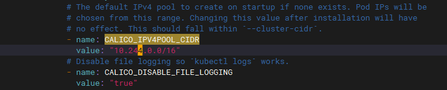
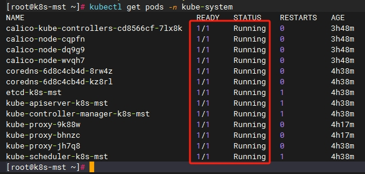
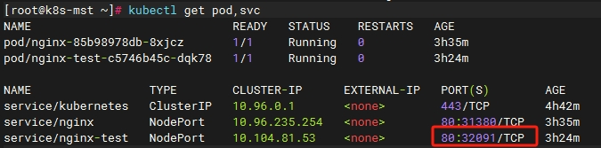
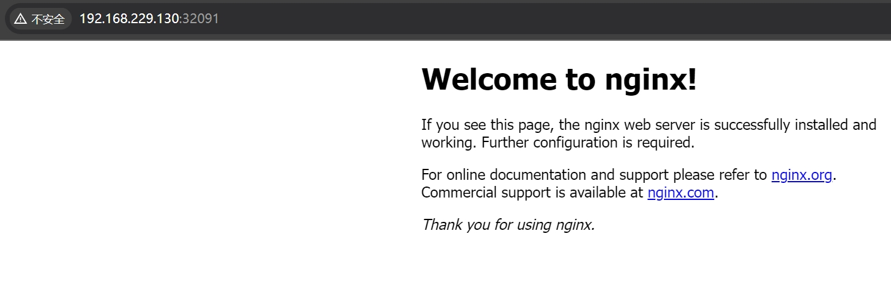

简单玩了一下K8S，安装也太费劲了，一大堆坑，浅浅记录一下吧。

### 安装环境

1. CentOS Stream release 8
<!--more-->
2. K8S v1.23.6
3. Docker version 26.0.0, build 2ae903e

|主机名|IP|CPU|内存|
|:---:|:---:|:---:|:---:|
|k8s-mst|192.168.229.130|4|8G|
|k8s-nd1|192.168.229.131|4|4G|
|k8s-nd2|192.168.229.132|4|4G|

### 安装步骤

> 下面的步骤2.1-2.8，是需要在三台虚拟机上都执行的；2.9-2.10只在master主机执行即可；2.11在所有节点主机执行即可；2.12-2.14在master主机执行即可。

#### 基础操作

下面的操作代表的含义依次是：关闭防火墙、关闭selinux、关闭swap分区

```bash
systemctl stop firewalld && systemctl disable firewalld && iptables -F
sed -i 's/enforcing/disabled/' /etc/selinux/config && setenforce 0
swapoff -a
sed -ri 's/.*swap.*/#&/' /etc/fstab
```

#### 分别修改各主机的主机名

```bash
hostnamectl set-hostname k8s-mst
hostnamectl set-hostname k8s-nd1
hostnamectl set-hostname k8s-nd2
```

#### 修改各主机的hosts文件

```bash
192.168.229.130 k8s-mst
192.168.229.131 k8s-nd1
192.168.229.132 k8s-nd2
```

利用 `scp` 命令将 `/etc/hosts` 文件复制到其他主机

```bash
scp /etc/hosts k8s-nd1:/etc/hosts
```

#### 修改内核参数

```bash
cat > /etc/sysctl.d/k8s.conf << EOF
net.bridge.bridge-nf-call-ip6tables = 1
net.bridge.bridge-nf-call-iptables = 1
net.ipv4.ip_forward = 1
EOF

sysctl --system
```

#### [安装Docker](https://nustarain.gitee.io/2023/10/30/DockerInit)

```bash
curl -fsSL https://get.docker.com | bash -s docker
```

如果要适配K8S，需要对Docker的daemon.json文件进行升级，配置如下：

```bash
cat > /etc/docker/daemon.json << EOF
{
"registry-mirrors": ["https://gqs7xcfd.mirror.aliyuncs.com","https://hub-mirror.c.163.com"],
"exec-opts": ["native.cgroupdriver=systemd"],
"log-driver": "json-file",
"log-opts": {
"max-size": "100m"
},
"storage-driver": "overlay2"
}
EOF
```

启动Docker服务

```bash
systemctl daemon-reload && systemctl enable --now docker
```

#### 配置K8S的yum源

需要自己添加一个用于下载K8S的yum源，这里我使用的是阿里云的源。

```bash
cat > /etc/yum.repos.d/kubernetes.repo << EOF
[kubernetes]
name=Kubernetes
baseurl=https://mirrors.aliyun.com/kubernetes/yum/repos/kubernetes-el7-x86_64/
enabled=1
gpgcheck=1
repo_gpgcheck=1
gpgkey=https://mirrors.aliyun.com/kubernetes/yum/doc/yum-key.gpg https://mirrors.aliyun.com/kubernetes/yum/doc/rpm-package-key.gpg
EOF
```

#### 安装K8S

1.24.X 版本都不再兼容Docker，所以还是使用1.23.X版本。

```bash
yum install -y kubelet-1.23.6 kubeadm-1.23.6 kubectl-1.23.6
```

#### 启动K8S服务

```bash
systemctl enable --now kubelet
```

#### 初始化K8S集群

```bash
kubeadm init \
--kubernetes-version 1.23.6 \
--apiserver-advertise-address=192.168.229.130 \
--service-cidr=10.96.0.0/12 \
--pod-network-cidr=10.244.0.0/16 \
--image-repository registry.aliyuncs.com/google_containers
```

- kubernetes-version 集群版本
- apiserver-advertise-address API服务器通告地址，即k8s主节点。
- service-cidr 服务网段
- pod-network-cidr Pod网段
- image-repository 镜像仓库

这一步会产生很多奇奇怪怪的问题，但是如果是按照我这个步骤和版本安装下来的，估计是不会出问题的。安装完事之后如果看到如下输出，说明安装成功了。

```bash
kubeadm join 192.168.229.130:6443 --token iks8xq.pqnnn0uvotgtloyj \
--discovery-token-ca-cert-hash
sha256:674a06791e7637efccdaf9874346d0815a6f864a29670acccaa2aa1c998e2ef4 
```

#### 配置kubectl

不要清屏，按照上面的提示，依次执行他给出来的命令。

```bash
mkdir -p $HOME/.kube
sudo cp -i /etc/kubernetes/admin.conf $HOME/.kube/config
sudo chown $(id -u):$(id -g) $HOME/.kube/config
```

#### 节点加入集群

如果还留着提示，直接复制他给出的`kubeadm join`命令，然后执行即可。如果丢了，需要手动查看一下两个参数，`--token`和`--discovery-token-ca-cert-hash`。

token可以使用如下命令查看，比如是“xxxxxx”。

```bash
kubeadm token list
```

discovery-token-ca-cert-hash可以使用如下命令查看，比如是“yyyyyy”。

```bash
openssl x509 -pubkey -in /etc/kubernetes/pki/ca.crt | openssl rsa -pubin -outform der 2> /dev/null | openssl dgst -sha256 -hex | sed 's/^.* //'
```

然后给他们组合到一块

```bash
kubeadm join 192.168.229.130:6443 --token xxxxxx \
--discovery-token-ca-cert-hash sha256:yyyyyy
```

#### 安装网络插件CNI

```bash
mkdir /opt/k8s && cd /opt/k8s
curl https://calico-v3-25.netlify.app/archive/v3.25/manifests/calico.yaml -O
```

这个时我们就下载了一个文件名字叫：calico.yaml，但是这个文件需要改一下cidr。这里的cidr就是我们初始化时候`--pod-network-cidr`字段的cidr。

vim calico.yaml，搜索“CALICO_IPV4POOL_CIDR”。



#### 下载calico.yaml文件里描述的镜像

calico.yaml 里面用的都是docker.io的镜像，你可以先使用`grep image calico.yaml`命令查看一下。然后我们做一下修改，执行以下命令：

```bash
sed -i 's#docker.io/##g' calico.yaml 
```

完事后你也可以再验证一下：`grep image calico.yaml`。然后kubectl apply一下：

```bash
kubectl apply -f calico.yaml
```

这个时候kebe就会自己去下载镜像了，不会前台显示，下载速度取决于你的网速。但是你可以通过`kubectl get pods -n kube-system`命令查看一下，如果镜像下载完了，就会看到如下输出，所有容器都是运行起来的：



这样就完成了K8S的安装。

#### 验证

我们可以去运行一个nginx实例，去看看到底还有没有什么问题。

```bash
kubectl create deployment nginx --image=nginx
kubectl expose deployment nginx --port=80 --type=NodePort
kubectl get pod,svc
```



在宿主机上访问节点IP:port。



### 其他高级配置

#### 配置在其他节点的控制

这个就是说在任何节点上都可以对k8s的API-server进行访问，对节点进行管理。换言之，你不配置这一步，你只能在主节点进行`kubectl get nodes`命令，其他节点执行不了。

```bash
scp /etc/kubernetes/admin.conf root@k8s-nd1:/etc/kubernetes
scp /etc/kubernetes/admin.conf root@k8s-nd2:/etc/kubernetes
```

拷贝过去之后，分别在两个节点上执行如下命令：

```bash
echo "export KUBECONFIG=/etc/kubernetes/admin.conf" >> ~/.bash_profile
source ~/.bash_profile
kubectl get node
```

如果显示有效内容，说明配置成功了。

#### 配置kubectl命令自动补全

初始配置K8S是不能进行命令补全的，使用起来太麻烦，尤其是对于我这个<kbd>Tab</kbd>键重度使用者，实在太不爽。下面是配置K8S命令补全的方法：

> 一般在master节点执行就可以满足需求，但是如果有需求，也可以在worker节点上配置。

```bash
yum install -y bash-completion
source /usr/share/bash-completion/bash_completion
source <(kubectl completion bash)
echo "source <(kubectl completion bash)" >> ~/.bashrc
```