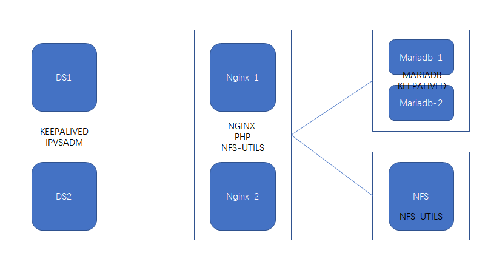
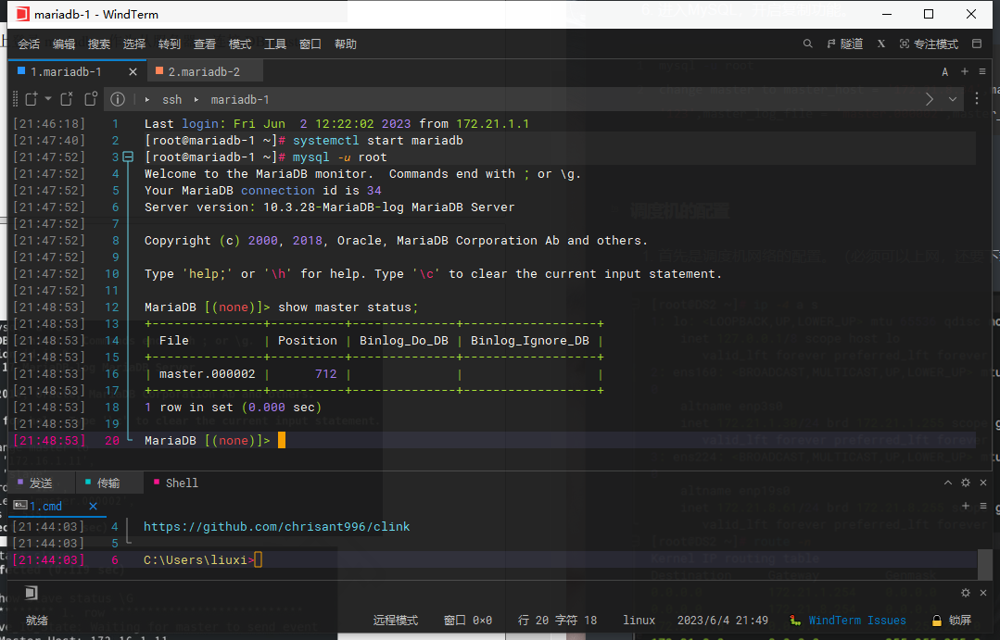
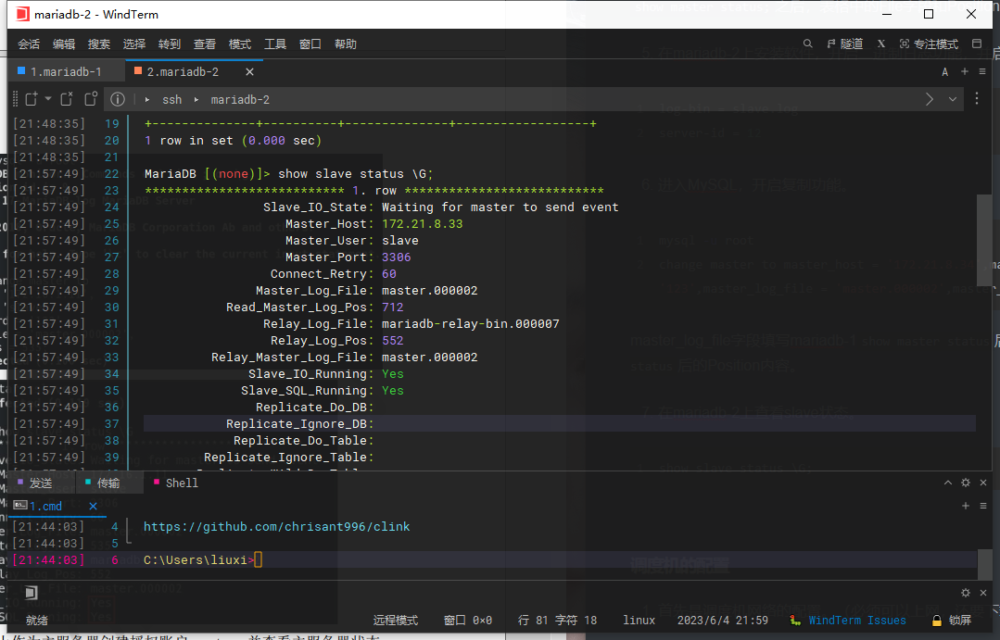
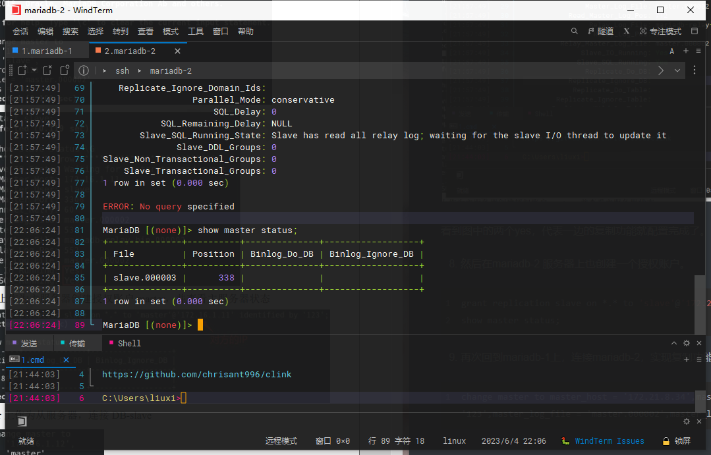
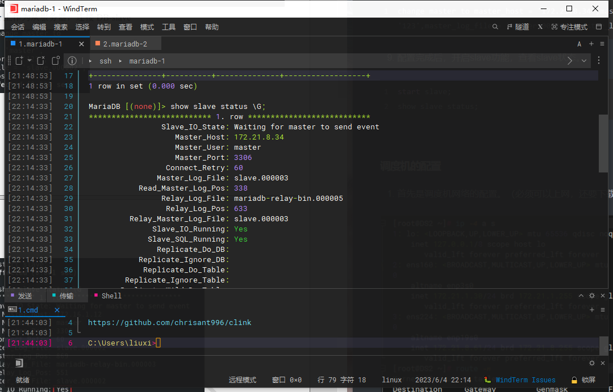
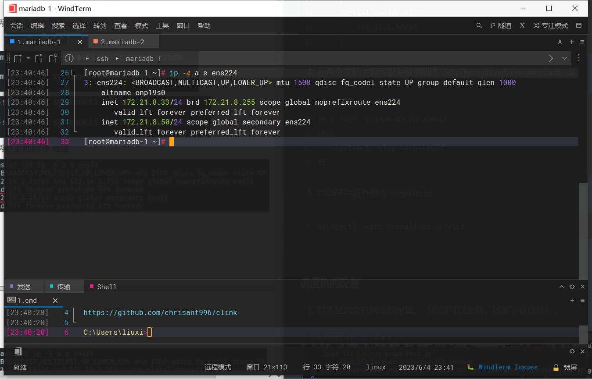

在最后的Linux高级课程的最后，完成了高可用负载均衡WEB服务器的搭建，比较贴合实际的生产环境，一共使用到了7台虚拟机，在我这个阶段，已经是我取得的最高成就了。感觉有必要记录下来，既是帮助后来者，也是方便自己日后进行复习总结。

### 项目梗概

项目一共设计7台虚拟机，其中2台作为调度机，进行对访问请求的分配；2台作为Nginx服务器；2台作为Mariadb数据库服务器；一台作为NFS储存服务器，负责存储Nginx服务器的网页资源。其逻辑拓扑图如下：

<!-- more -->



我会分几个部分来介绍这个项目的配置，本次先来介绍mariadb实现双主复制和keepalived。

其中服务器的IP规划如下：

|  主机名   |  角色  | 网卡名 |  模式  |       IP        |       VIP       |      网关       |
| :-------: | :----: | :----: | :----: | :-------------: | :-------------: | :-------------: |
| mariadb-1 | mst/slv  | ens224 | 仅主机 | 172.21.8.33/24  | 172.21.8.50/24  | 172.21.8.254/24 |
| mariadb-2 | mst/slv  | ens224 | 仅主机 | 172.21.8.34/24  | 172.21.8.50/24  | 172.21.8.254/24 |


### 数据库服务器的配置

数据库服务器在本项目中采用双主复制的方式，来进行高可用的实现。

#### 主从复制配置

|  主机名   |    身份    | 网络接口 | 连接模式 |       IP       |
| :-------: | :--------: | :------: | :------: | :------------: |
| mariadb-1 |  主服务器  |  ens224  |  仅主机  | 172.21.8.33/24 |
| mariadb-2 | 备份服务器 |  ens224  |  仅主机  | 172.21.8.34/24 |


1. 首先在mariadb-1中进行软件的安装。

```bash
yum install -y mariadb-server
```

2. 修改配置文件。

主配置文件`/etc/my.cnf`无需修改，修改`/etc/my.cnf.d/mariadb-server.cnf`文件，在[mysqld]段下面添加配置选项，开启二进制日志功能并设置server-id。

```bash
log-bin = master.log
server-id = 11
```

3. 启动mariadb-1的mariadb服务

```
systemctl start mariadb
```

4. 进入MySQL，作为主服务器创建授权账户slave，并查看主服务器装态。

```bash
mysql -u root
```

```bash
grant replication slave on *.* to 'slave'@'172.21.8.34' identified by '123';
```

>授权为对方的IP

```bash
show master status;
```



`show master status;`之后，表格中的File字段和Position字段要留意，待会要用到。

5. 在mariadb-2上安装软件，开启二进制日志功能，并启动服务。

```bash
log-bin = slave.log
server-id = 12
```

6. 进入MySQL，开启复制功能。

```bash
mysql -u root
change master to master_host = '172.21.8.34',master_user = 'slave',master_password = '123',master_log_file = 'master.000002',master_log_pos = 712;
```

master_log_file字段填写mariadb-1`show master status`后的File内容，master_log_pos填写mariadb-1`show master status`后的Position内容。

7. 在mariadb-2上查看slave状态。

```
start slave;
show slave status \G;
```



看到图中的两个yes，代表一边的复制功能就配置完成了。

8. 然后在mariadb-2 服务器上也创建一个授权账户。

```bash
grant replication slave on *.* to 'slave'@'172.21.8.33' identified by '123';
```

>授权为对方的IP

```bash
show master status;
```



再次回到mariadb-1上，连接mariadb-2，实现复制功能。

```
change master to master_host = '172.21.8.34',master_user = 'slave',master_password = '123',master_log_file = 'master.000003',master_log_pos = 338;
```

9. 配置完成后，开启slave功能，查看slave状态。

```bash
start slave;
show slave status;
```



到这里数据库的主从复制已经完成了，接下来要配置数据库的keepalived功能。

#### keepalived配置

1. 主机 DB-master 和 DB-slave 上安装 Keepalived

```bash
yum install -y keepalived
```

2. 把配置文件保留一个副本

```
cp /etc/keepalived/keepalived.conf{,.bak}
```

3. 修改两个主机上的配置文件/etc/keepalived/keepalived.conf

|  主机名   | route_id  | vrrp_instance | state  | interface | virtual_router_id | priority | virtual_ipaddress |
| :-------: | :-------: | :-----------: | :----: | :-------: | :---------------: | :------: | :---------------: |
| mariadb-1 | db_master |  mariadb-ha   | BACKUP |  ens224   |        60         |   100    |  172.21.8.33/24   |
| mariadb-2 | db_slave  |  mariadb-ha   | BACKUP |  ens224   |        60         |    90    |  172.21.8.34/24   |

* mariadb-1 的`/etc/keepalived/keepalived.conf` 的内容如下 

全局配置模块

```bash
! Configuration File for keepalived

global_defs {
   notification_email {
     liuxp731@qq.com	# 管理员邮箱
   }
   notification_email_from Alexandre.Cassen@firewall.loc
   smtp_server 127.0.0.1
   smtp_connect_timeout 30
   router_id db_master	# 标识
   vrrp_skip_check_adv_addr
   vrrp_strict
   vrrp_garp_interval 0
   vrrp_gna_interval 0
}
```

启用 vrrp_script 模块， 定义对 mariadb 服务的监测

```bash
vrrp_script check_mariadb {
   script "/etc/keepalived/checkmariadb.sh"
   interval 2
}
```

VRRPD 配置段  

```bash
vrrp_instance mariadb-ha {
    state BACKUP	# 备用
    interface ens224
    nopreempt		# 设置不抢占
    virtual_router_id 60
    priority 100	# 优先级
    advert_int 1
    authentication {
        auth_type PASS
        auth_pass 1111
    }
    track_script {	# 配合vrrp_script段使用
        check_mariadb
    }
    virtual_ipaddress {	# 虚拟出的VIP
        172.21.8.50/24
    }
}
```

* mariadb-2 的`/etc/keepalived/keepalived.conf` 的内容如下 

全局配置段

```bash
! Configuration File for keepalived

global_defs {
   notification_email {
     liuxp731@qq.com
   }
   notification_email_from Alexandre.Cassen@firewall.loc
   smtp_server 127.0.0.1
   smtp_connect_timeout 30
   router_id db_slave
   vrrp_skip_check_adv_addr
   vrrp_strict
   vrrp_garp_interval 0
   vrrp_gna_interval 0
}
```

启用 vrrp_script 模块， 定义对 mariadb 服务的监测

```bash
vrrp_script check_mariadb {
   script "/etc/keepalived/checkmariadb.sh"
   interval 2
}
```

VRRPD 配置段

```bash
vrrp_instance mariadb-ha {
    state BACKUP
    interface ens224
    virtual_router_id 60
    priority 90
    advert_int 1
    authentication {
        auth_type PASS
        auth_pass 1111
    }
    track_script {
        check_mariadb
    }
    virtual_ipaddress {
        172.21.8.50/24
    }
```

4. 在两个主机上编写服务检测脚本`/etc/keepalived/checkmariadb.sh`

```bash
#!/bin/bash
if ! lsof -i:3306 &> /dev/null
then
    systemctl stop keepalived
fi
```

5. 启动两台服务器的`keepalived`

```bash
systemctl start keepalived.service
```



可以看出mariadb-1主机已经多出来一个172.21.8.50/24的一个IP，这个就是虚拟出来的VIP，当mariadb-1主机宕掉，这个IP就会漂移到mariadb-2主机上，到这里就完成了mariadb双主复制和keepalived的实现。
