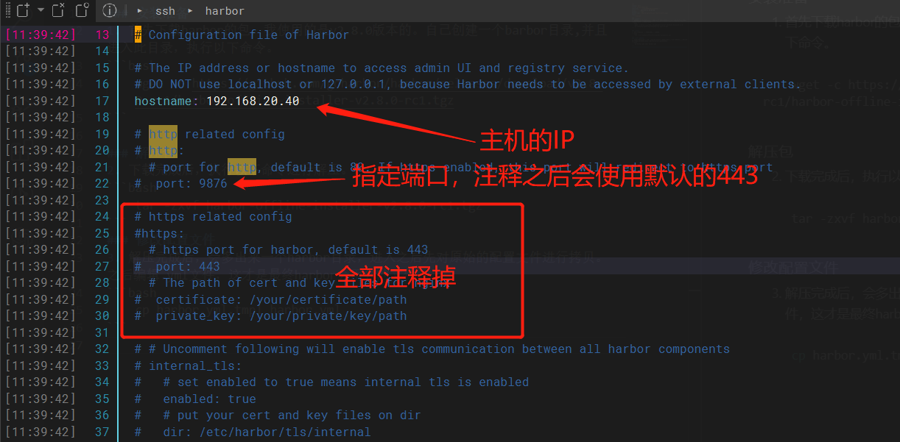
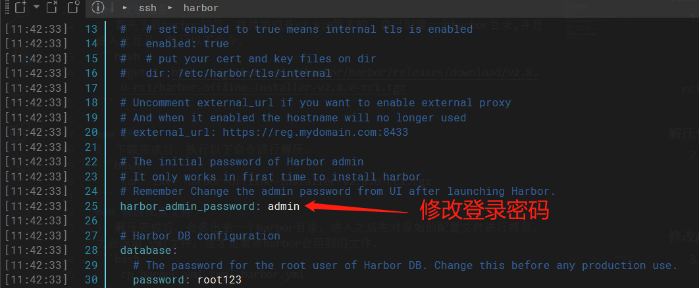
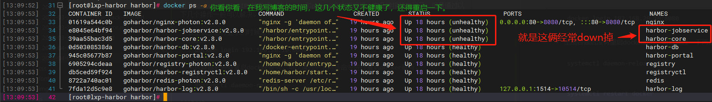

### 安装准备

1. 首先下载harbor的包，我使用的是v2.8.0版本的。自己创建一个barbor目录,并且进入此目录，执行以下命令。

```bash
wget -c https://github.com/goharbor/harbor/releases/download/v2.8.0-rc1/harbor-offline-installer-v2.8.0-rc1.tgz
```

### 解压包

2. 下载完成后，执行以下命令进行解压。

<!-- more -->

```bash
tar -zxvf harbor-offline-installer-v2.8.0-rc1.tgz 
```

### 修改配置文件

3. 解压完成后，会多出来一个harbor目录，进入之后先对原始的配置文件进行拷贝。之后编辑.yml文件，这才是最终harbor会用到的文件。

```bash
cp harbor.yml.tmpl harbor.yml
```

按照自己的意愿修改端口和登录密码，其他的不用修改，最后保存退出。





### 执行可执行文件

4. 修改完成配置文件后，执行以下命令，之后会根据.yml文件***生成很多容器***。

```bash
./install.sh 
```

等待容器生成，这个时候可以通过浏览器输入IP:port的方式进行访问了，但是如果是在别的主机上进行docker login IP 的方式，输入user和passwd会出现报错，有几种报错忘记了，但是通过以下几个操作一般可以解决。

### 报错解决

5. 在主机上进行登录的时候忘记输入端口号

```bash
docker login 192.168.20.10:8080
```

6. 生成容器后没有重启docker服务，可以通过一下两条命令进行重启docker服务。

```bash
systemctl daemon-reload
```

```bash
systemctl restart docker
```

7. 最后一条也是最重要的一条，一定要检查执行install.sh脚本后，生成的容器是否都处于运行的状态。因为经常有一些容器没有运行起来，我手头这边就出现两个容器没有运行起来。



执行以下命令查看运行的/运行过的容器。

```bash
docker ps -a
```

执行以下命令重启容器

```bash
docker restart '容器ID'
```

最后可以再检查一下容器的状态，确保每一个都是up起来的，并且都是healthy状态。都进行完成后，浏览器也好，主机也好，应该都可以进行登录了。