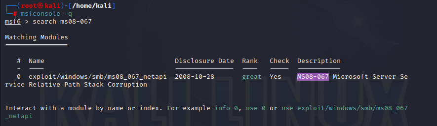
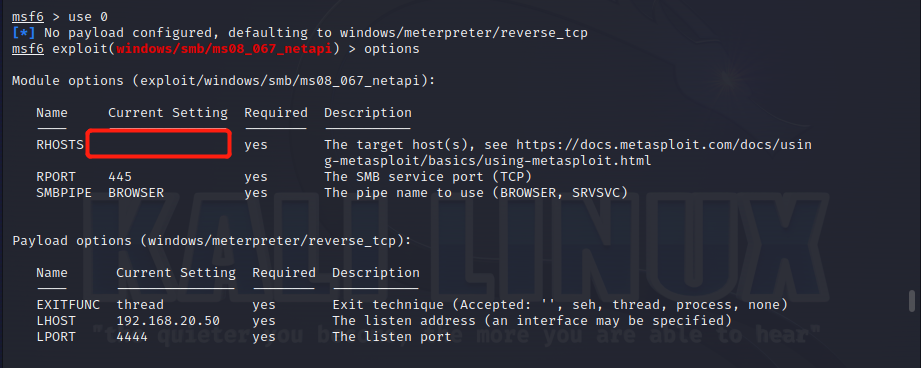
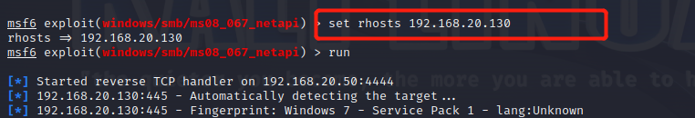
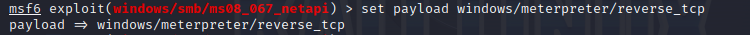
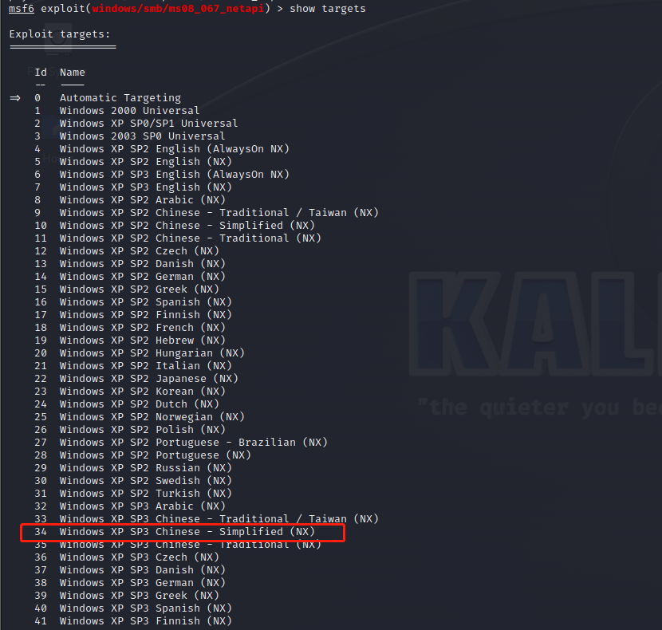
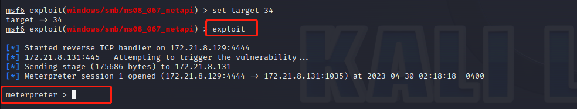

### 准备工作

攻击机：kali，差不多的版本都可以，我用的是Linux kali 6.1.0-kali5-amd64 #1 SMP PREEMPT_DYNAMIC Debian 6.1.12-1kali2 (2023-02-23) x86_64 GNU/Linux，可以使用命令```uname -a```查看。

靶机：XP windows，下载链接，推荐使用电脑版的腾讯微云下载，这是目前我找到的最好用的ed2k的下载工具了。

<!-- more -->

```bash
ed2k://|file|sc_winxp_tablet_2005_CD1.iso|629227520|505B810E128351482AF8B83AC4D04FD2|/
```

### 域内扫描

攻击第一步，先扫描网络内存活并可以利用的主机。

```bash
nmap -T4 -A -v -Pn 192.168.20.1/24
```

### 开始攻击

1. 执行```msfconsole -q```。
2. 搜索```ms08-067```。



3. 设置攻击前必要的参数。从上图看到，只有一个可用的模块。我们就使用这个模块。然后可以使用```show options```先查看都需要让我们设置哪些参数。



4. 设置参数。上图看到，我们需要设置```rhosts```（靶机IP）。



5. 然后设置payload reverse_tcp



6. 最后设置靶机的类型，在这我选择34。



7. 设置好就可以开始攻击了。



最后返回meterpreter，攻击成功。