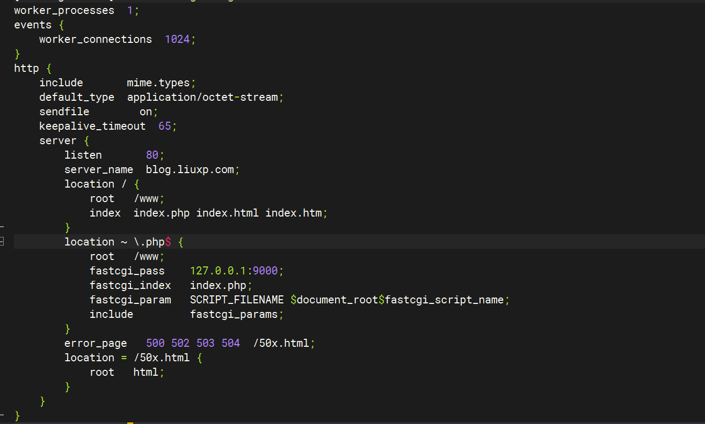

### NGINX整合PHP

这个实现起来比较简单，就是一段代码的事，但是之前没有出现我这样的开源工作者的时候，我只能手敲那一段代码，有时候一不留神就会把单词拼错，尤其是朱行查找错误的时候，简直苦不堪言。为了后浪们的幸福生活，再次我将那一段代码写下来供你们<kbd>Ctrl</kbd>+<kbd>C</kbd>和<kbd>Ctrl</kbd>+<kbd>V</kbd>使用。

<!-- more -->

具体操作如下：

* 打开NGINX的配置文件,添加这一段。

```bash
        location ~ \.php$ {
            root   /web;
            fastcgi_pass    127.0.0.1:9000;
            fastcgi_index   index.php;
            fastcgi_param   SCRIPT_FILENAME $document_root$fastcgi_script_name;
            include         fastcgi_params;
        }
```

补一张图片显示要插入的位置。



然后就完成了NGINX和PHP的联动。