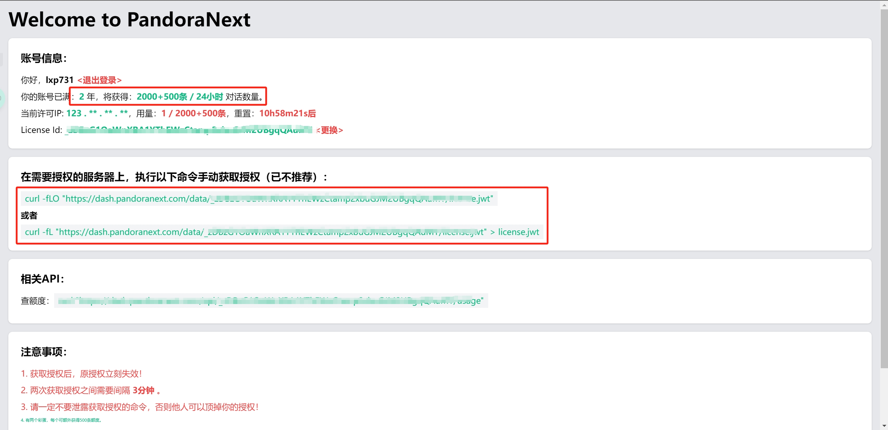

### 背景 

由于 [**pandora**](https://github.com/cloud804d/mirrors-pengzhile-pandora) 项目被攻击加之开发者的 github 账号频繁被封，作者重新开了新账号进行项目的开发，于是有了功能更强大的 [**pandora-next**](https://github.com/pandora-next/deploy?tab=readme-ov-file)

### 准备工作

有一个 github 的账号，最好是注册了一年以上的。

<!-- more -->

* [**注册github账号**](https://github.com/)

有 docker 环境，最好有 docker-compose 环境。   
* [**安装docker环境教程**](https://nustarain.gitee.io/2023/10/30/DockerInit/?highlight=docker)
* [**安装docker-compose环境教程**](https://nustarain.gitee.io/2023/11/03/install-docker-compose/?highlight=docker)

接下来就是教程时间。

### 配置步骤

1. 首先克隆项目的仓库。

```bash
git clone https://gitclone.com/github.com/pandora-next/deploy.git
```

2. 执行以下操作。

```bash
mv deploy/ pandora_next
cd pandora_next/
rm -rf best.php README.md 
```

3. 获取 license_id 

在这里获取：[https://dash.pandoranext.com](https://dash.pandoranext.com)   
然后会要求你登录 github 的账号，正常登录，然后会出现以下页面。



* github 账号注册时间主要是影响每天的对话数量。
* 复制下面的 license_id，待会儿会用到。
* 如果是在 VPS 上搭建的话，可以执行下面的随便一条命令来下载 license.jwt 文件，下载后不需要更改，放在 pandora_next 目录下就可以。

4. 修改 config.json 文件

```bash
cd data/ && vim config.json
```

* "bind": "0.0.0.0:8181" 默认使用的8181端口，可以在这里进行修改。
* 修改 license_id 字段，将之前复制的 license_id 复制到这里。
* site_password 字段是进入 Web 时要填的密码。
* setup_password 字段是管理配置文件的密码，使用方法是在浏览器搜索框输入`127.0.0.1:8181/setup`

其他字段的含义可以查看[**官方的说明文档**](https://docs.pandoranext.com/zh-CN/configuration/config)

5. 启动容器

```bash
cd .. && docker-compose up -d
```

6. 大功告成，浏览器访问即可，下期介绍 [**pandora-next 关于 token.json 的进阶操作**]()。