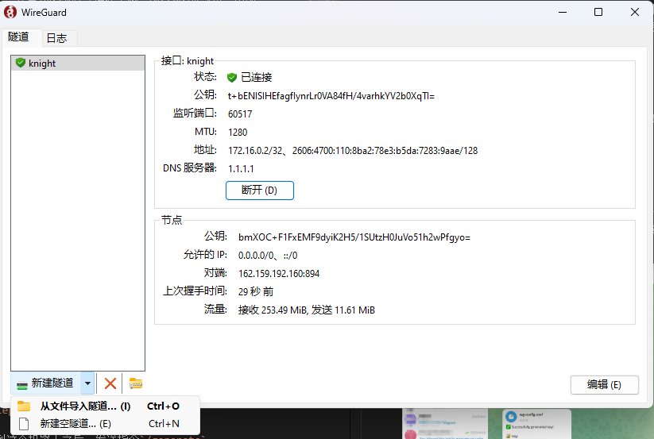
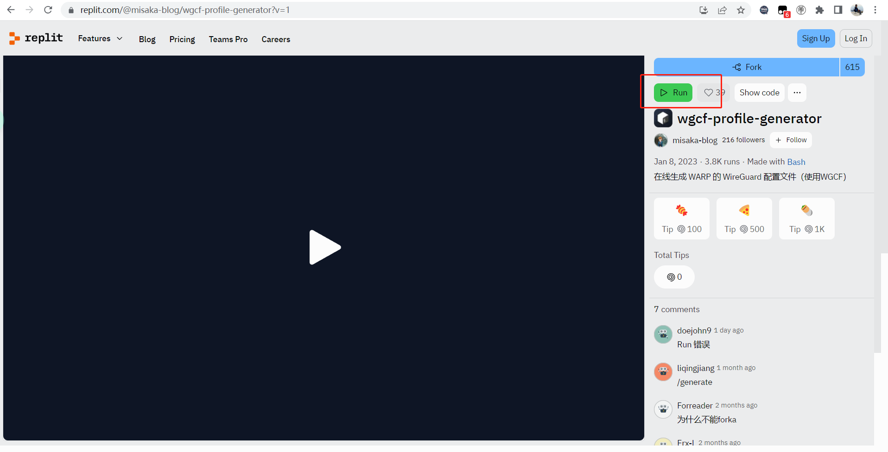
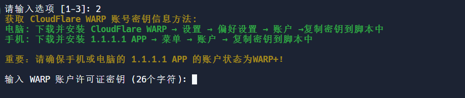
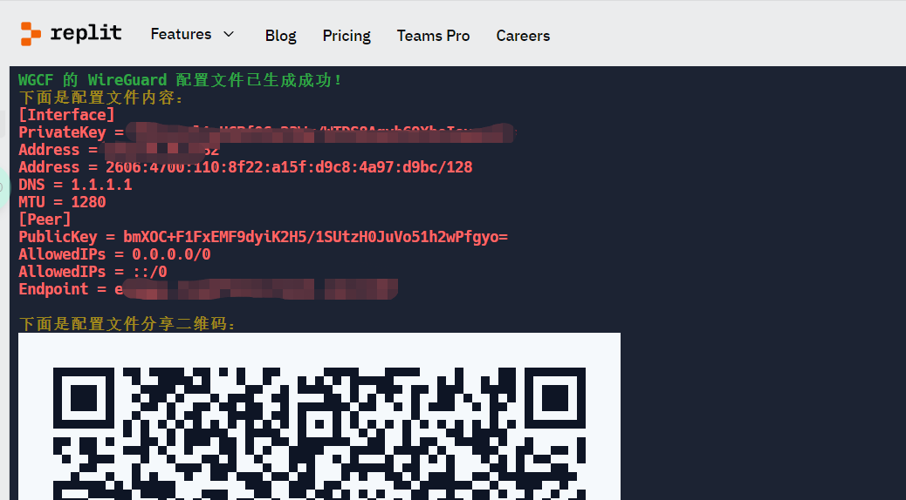
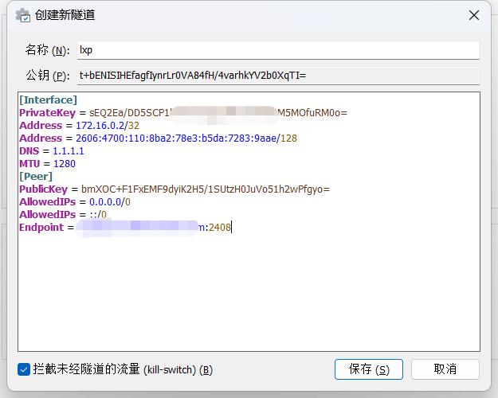
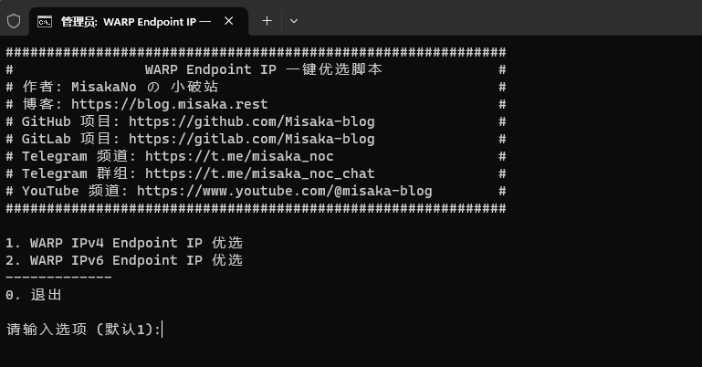
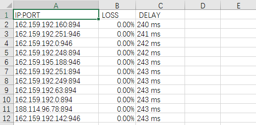

从我有了第一台电脑后，science online的手段也逐渐见证着我的成长，从最初的浏览器插件上网，到SSR的小飞机，再到V2ray，以及后面陪伴我最久的clash。可以说已经是身经百战的老油条了。到今天我又遇到了一个具有里程碑式的science online手段**CloudFlare+Warp+ 优选IP**。

CloudFlare拥有极高的业界权威，拥有顶尖的技术团队，拥有最安全的网络方案，他们公司的推出的science online技术那是无形中代表了一个技术标准的。在我实际体验下来，效果确实非常好，很舒服。

<!-- more -->

### 环境准备

虽说是教程，但可不是从0开始的教程。

* 需要拥有telegram账号和客户端，客户端可以是安卓、windows、Mac、iOS、Linux。

* [telegram官网](https://telegram.org/)

### 获取Warp+的永久免费流量

需要在telegram里搜索一个机器人，机器人叫“warp+ bot”，但是我试了一下，直接搜是搜不出来的，后来发现可以通过链接直接找到他，[链接地址](https://t.me/generatewarpplusbot)


* 找到这个机器人之后，发送指令`/generate`

* 然后他会让你关注两个类似公众号的东西，就是图中的`Warp Plus`和`akame.moe enjoyers`直接按他的意思进行关注

* 再次发送`/generate` 然后他会进行真人验证，给你出一道一位数相加的数学题

* 按照他的题，把答案写在命令之后，比如图中的`/generate 8`，然后就可以拿到一个秘钥，把这个秘钥留好，待会要用到。（其实不留好也没关系，丢了可以再申领一个，而且每个秘钥含的流量已经超过2EB了，所以说根本用不完，就差把永久免费写在脑门上了）

我也向大家提供几个可以直接使用的秘钥：

```bash 折叠代码
🔐 Key: T23Xt4d0-w6J8K04D-18l5xeE6 (24598562 GB)
🔐 Key: A7o25Ti0-6L73vi2x-85oL63gt (24598562 GB)
🔐 Key: l8PNO546-Lt90kn31-O659R1rZ (24598562 GB)
🔐 Key: 8Rh75w0a-7xO04f5W-B32tI8n9 (24598562 GB)
🔐 Key: jmB9306F-789SI6ph-7S365JVv (24598562 GB)
🔐 Key: 164biRE3-ct261Rh3-8y9RC6L5 (24598562 GB)
🔐 Key: 73sH81gV-7dDQ239P-5br73p6L (24598562 GB)
🔐 Key: 9BH18g0q-8TV9U6r4-zcDr8703 (24598562 GB)
🔐 Key: w9L6WQ14-t375aI2F-91j27zEW (24598562 GB)
🔐 Key: L76Hzc89-pN9r36S0-T85Jw0z9 (24598562 GB)
🔐 Key: hV25y10g-0Hi678gc-9b06HL5F (24598562 GB)
🔐 Key: 4BLI280U-B5c9d17X-57b89Njn (24598562 GB)
🔐 Key: 0e3d75yj-ga82N70x-YG3a5C06 (24598562 GB)
🔐 Key: N2C143ct-uea678k1-8mUot240 (24598562 GB)
🔐 Key: 6y4g9f7j-H198qdA6-9F2G8vw0 (24598562 GB)
🔐 Key: EGR3r108-eU0m381t-8Ec26i9t (24598562 GB)
🔐 Key: zg2B0W41-S16ye8m5-kEQ64R05 (24598562 GB)
🔐 Key: vgs159Q0-6OQe9v07-aj2385TU (24598562 GB)
🔐 Key: 6dU2q39L-207jq8nP-3V4L6Sl2 (24598562 GB)
🔐 Key: 19Gk4bL0-9V8XPS64-g72TEu90 (24598562 GB)
🔐 Key: C2045eQc-n0841qKY-4vV3jY08 (24598562 GB)
🔐 Key: p58J1O4H-P14tT65z-8Rr36mv4 (24598562 GB)
🔐 Key: 24n6m9eh-9T0jH35K-5k71A9mf (24598562 GB)
🔐 Key: 8dIB52E1-3s19ar7z-apS65f73 (24598562 GB)
🔐 Key: z4jG2I08-ha5Y2c17-5U8qi39F (24598562 GB)
🔐 Key: 2mp506db-L57S9Mu2-ey2WI461 (24598562 GB)
🔐 Key: 13R58eyJ-d79iD3I0-7Z64mz9L (24598562 GB)
🔐 Key: 154vY2qO-Kb51S83l-2J04FdQ7 (24598562 GB)
🔐 Key: 132oL6bq-K4S3oz05-h5324nxf (24598562 GB)
🔐 Key: f107WP6Q-g1e3wF74-18Q7lt5S (24598562 GB)
```

### 下载代理工具

这次需要的代理工具是wireguard，[官方下载链接](https://www.wireguard.com/install/)

[备用下载地址](https://pan.baidu.com/s/1Dlg26xlYBnfWNVXx0PWTdA?pwd=trha)
提取码：trha

下载完直接安装就OK。

这是软件的截图。



新用户没有配置是不会有配置信息的

* 首先左下角找到这个下拉框，点击新建空隧道

* 会让你起一个名字，随便起一个名字就好

* 公钥的部分不要动

* 再往下的文本块是配置信息，然后把画面停在这里，最小化，我们去生成配置信息

### 生成配置信息

利用一个在线的工具生成配置信息，[工具链接地址](https://replit.com/@misaka-blog/wgcf-profile-generator?v=1)



进入网站后，点击右上角的Run，稍等片刻


出现这个画面后，因为我们使用的是秘钥，对应的选项是2，输入2后回车。



这里让输入秘钥，就是之前在telegram获取的秘钥，粘贴在这里后回车。

之后会要求输入一个随机设备名，随便输入一个字符串回车就好。



生成的红色部分就是配置信息，把配置信息复制下来，然后粘贴在wireguard的文本块里，就像这样。



最后保存配置信息。

大多数情况下是没有办法直接使用的，因为现在拿到的IP并不是最优IP，所以需要另一个工具来帮助筛选最优的IP，需要注意的是，如果目前有在使用任何的代理或者science online工具必须要停下来，不然会极度影响最优IP的筛选。

### 筛选最优IP

[工具下载链接](https://gitlab.com/Misaka-blog/warp-script/-/blob/main/files/warp-yxip/warp-yxip-win.7z)

[备用下载链接](https://pan.baidu.com/s/1UZZsxrOWu-PglAx9IYFBKA?pwd=je5f)
提取码：je5f

这个工具是完全免费开源的，可以放心使用。

下载完解压，有一个`warp-yxip.bat`的文件，双击运行



选择IPV4的筛选，输入1，回车，等待片刻，进程运行完毕后，会在工具的目录下生成一个result的文件使用Excel打开。



* LOSS 是丢包率

* DELAY 是延迟

默认会把结果按从优到差进行排序，只需要从前面几个抽一个，复制好IP和端口号然后替换掉wireguard配置文件里的最后一项，比如`Endpoint = 162.159.192.160:894`。

补充一点，在wireguard里，如果需要再对配置文件进行更改，可以直接右击配置名称，选择“编辑所选隧道”。

配置到这里，就完成了，可以进行连接，开始science online旅程了。