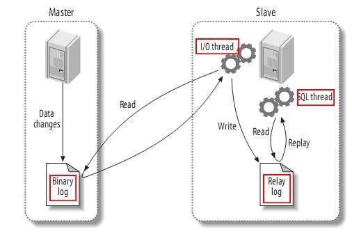

### 数据库复制的原理解读

最近进行的大三的小学期答辩属实是让我重新审视了自己，有些操作自己是会配置了，也可以达到自己的需求了，但是对于技术的底层逻辑和原理并不清楚，为了避免自己成为一个机械的打字员，有必要将一些技术的底层实现原理进行一些剖析。

这是网上找的数据库主从复制的原理图。接下来结合这张图来进行对数据库主从复制的原理讲解。

<!-- more -->

1. master首先记录二进制日志，将master主机上所有发生的操作（增删改）都记录到二进制日志中去。

2. slave会开启一个I/O进程，用来和master建立连接，进行binlog dump process。这个进程会从二进制日志中读取事件，如果二者是同步的，那么slave会进入休眠状态，等master产生新的事件，slave会通过I/O连接将新事件写进自己的中继日志里去。

3. SQL thread是复制的最后一步。SQL线程会从slave的中继日志中读取事件，并在本机中进行重放，直至与master的数据保持一致。

4. 通过课外资料的查询，还发现一个很有意思的点：复制过程有一个很重要的限制-->复制在slave上是串行化的，也就是说master上的并行更新操作不能在slave上并行操作。

### 额外的话

在平常项目中，老师验证你的数据库主从复制或者双主的依据就是观察数据库`show slave status \G`的`Slave_IO_Running`和`Slave_SQL_Running`两个“yes”。通过这个文章结合这张图片，突然就可以顿悟为什么这两个参数变为“yes”就代表数据库的复制功能是实现的了。