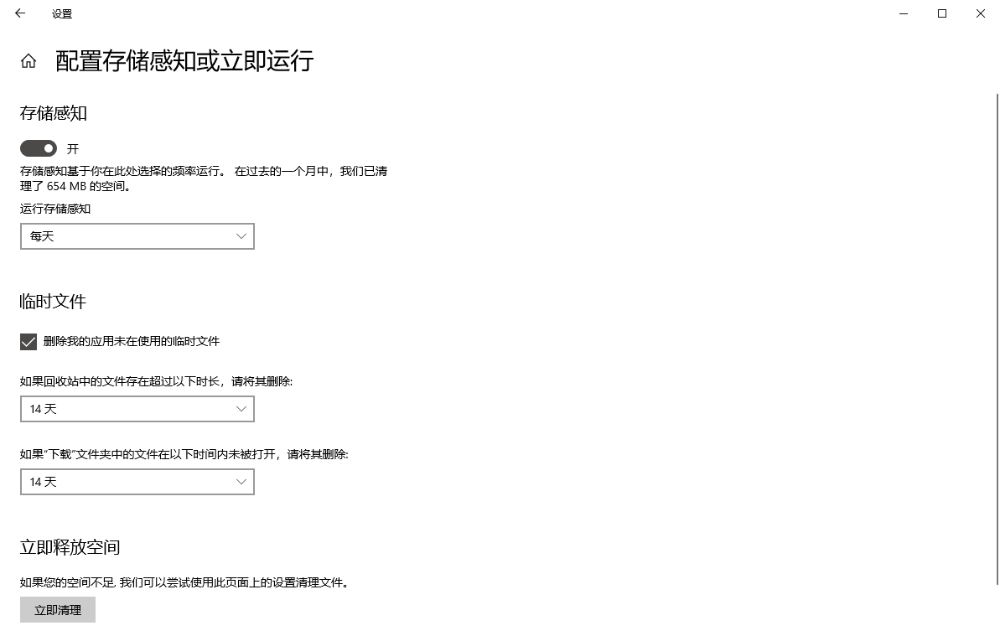
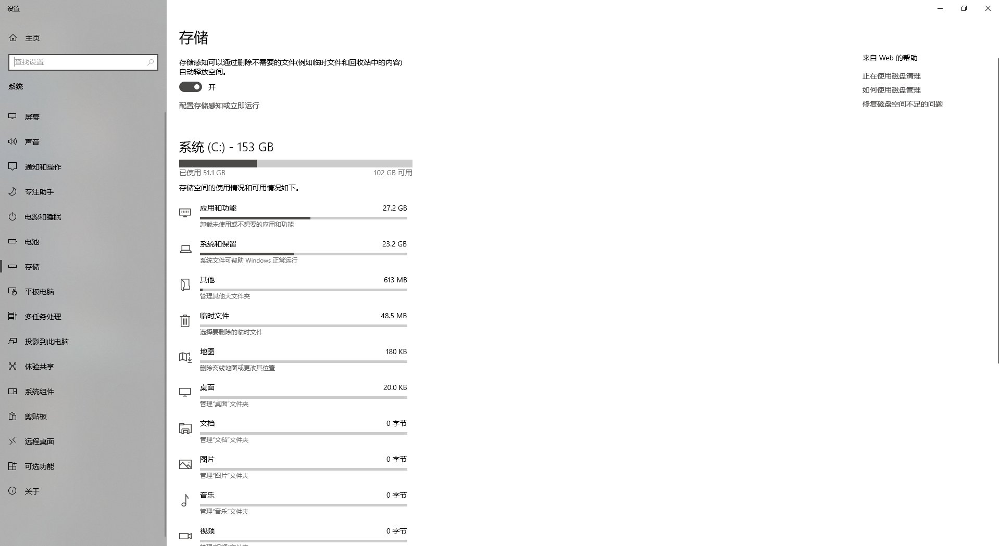
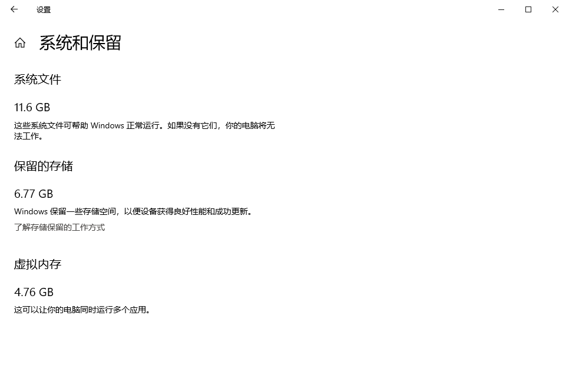

身边还是有不少朋友都是典型的C盘战士的，经常遇到爆红的情况，所以就盘点一些垃圾清理的方法送给她们吧。

### 配置存储感知

<kbd>Win</kbd> + <kbd>Q</kbd>搜索“存储感知”，将存储感知的开关打开，然后可以点击下方的“配置存储感知或立即运行”来进行第一遍的存储清理。   

<!--more-->

可以将运行存储感知调整为每天，那Windows就会每天自动进行存储清理，还可以将临时文件的部分按照需要进行设置，如下图，我个人是更倾向于14天的（半个月没用到的文件估计没多重要，就删除）。

> 当然如果14天也会误删重要文件，那就只能养成一个良好的存储文件的习惯，不要直接将文件丢在C盘。



### 系统存储清理

如下图所示，C盘分门别类地列出了很多文件选项。从“临时文件”选项包括“临时文件”这些文件选项都是可以清理的，都不会影响系统运行。唯一需要自己判断的就是“桌面”“文档”“图片”“视频”这些文件选项可能会包含之前盲目点击“下一步”而存在的重要文件，所以需要自己判断，删的时候也要擦亮双眼。



#### 应用和功能

这里面能做的就是卸载一些一辈子用不上的应用，可以起到的作用其实微乎其微，但是对自己没用的东西其实真的没必要留着对吧。

#### 系统和保留

系统和保留里面“系统文件”“保留的存储”就别想着动了。  

如我下图给的样例，有些人可能会多一个“休眠文件”选项，而且使用的空间还很多。休眠文件保证计算机在关机的状态下，保留电脑运行的任务，比如浏览器打开的页面、音乐播放器的进度等。有利就有弊，这些需要计算机记忆的东西因为要关机不可以保存到内存，就只能保存到硬盘了，所以休眠文件会占用很多空间。



##### 清理休眠文件

清理休眠文件的逻辑就是先关闭休眠功能，将之前的休眠文件删除，然后再打开休眠功能，休眠文件是随着休眠次数增多而增加的，所以可以在需要的时候就重新生成一下。

关闭休眠功能，<kbd>Win</kbd>+<kbd>Q</kbd>搜索“cmd”，以管理员身份打开。输入下面的命令。

```bash
powercfg -h off
```

